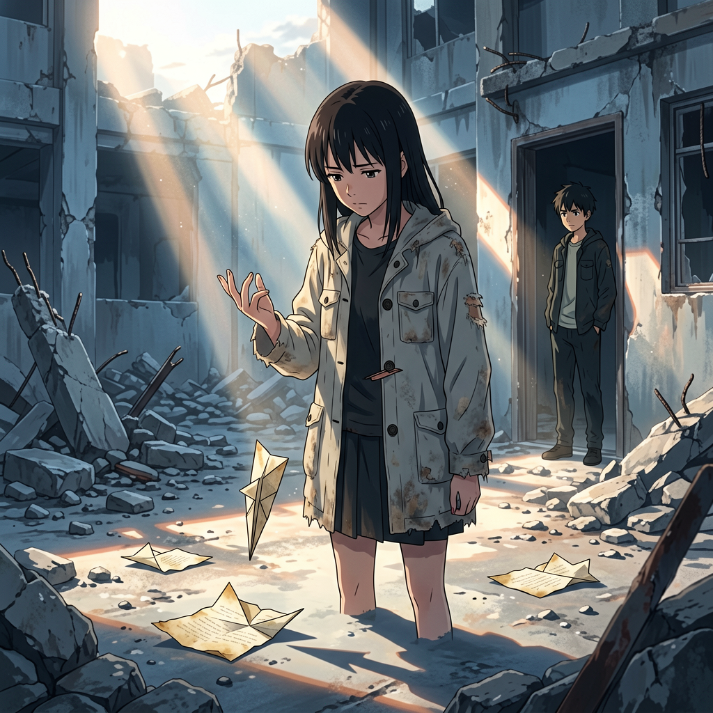
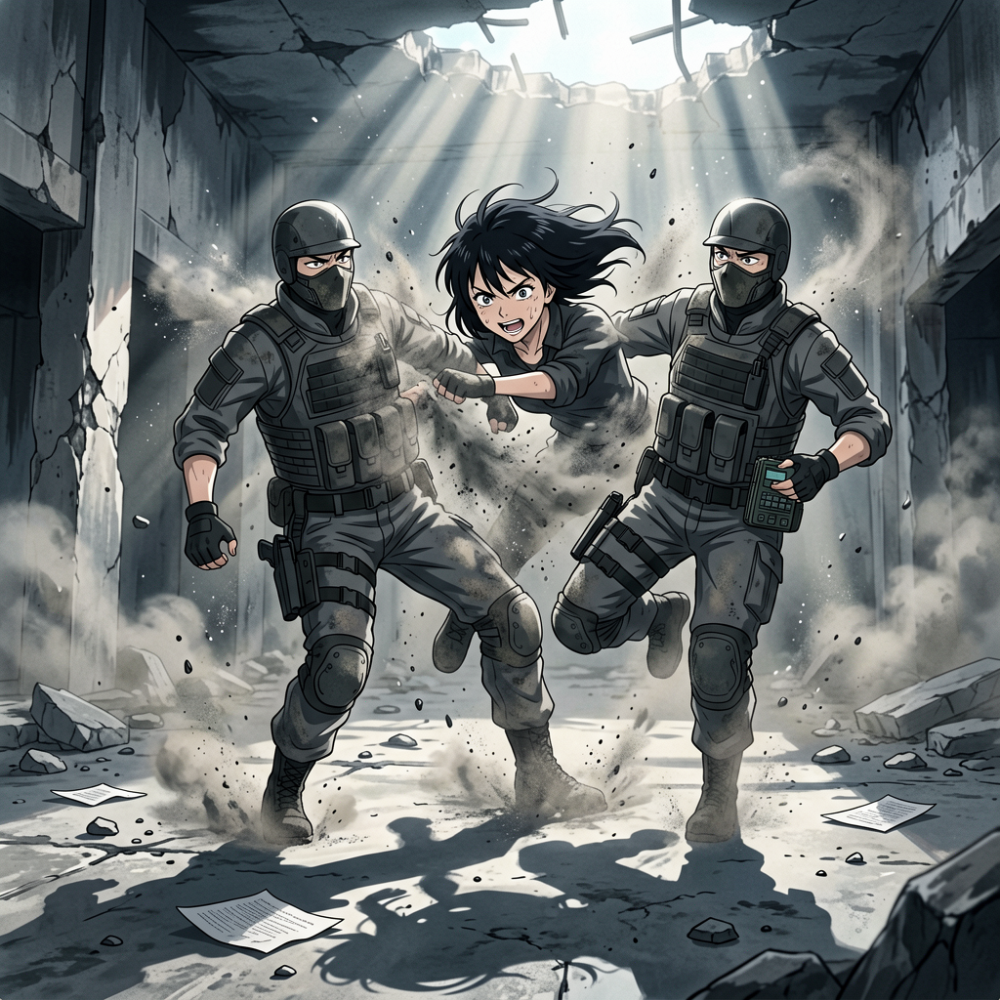
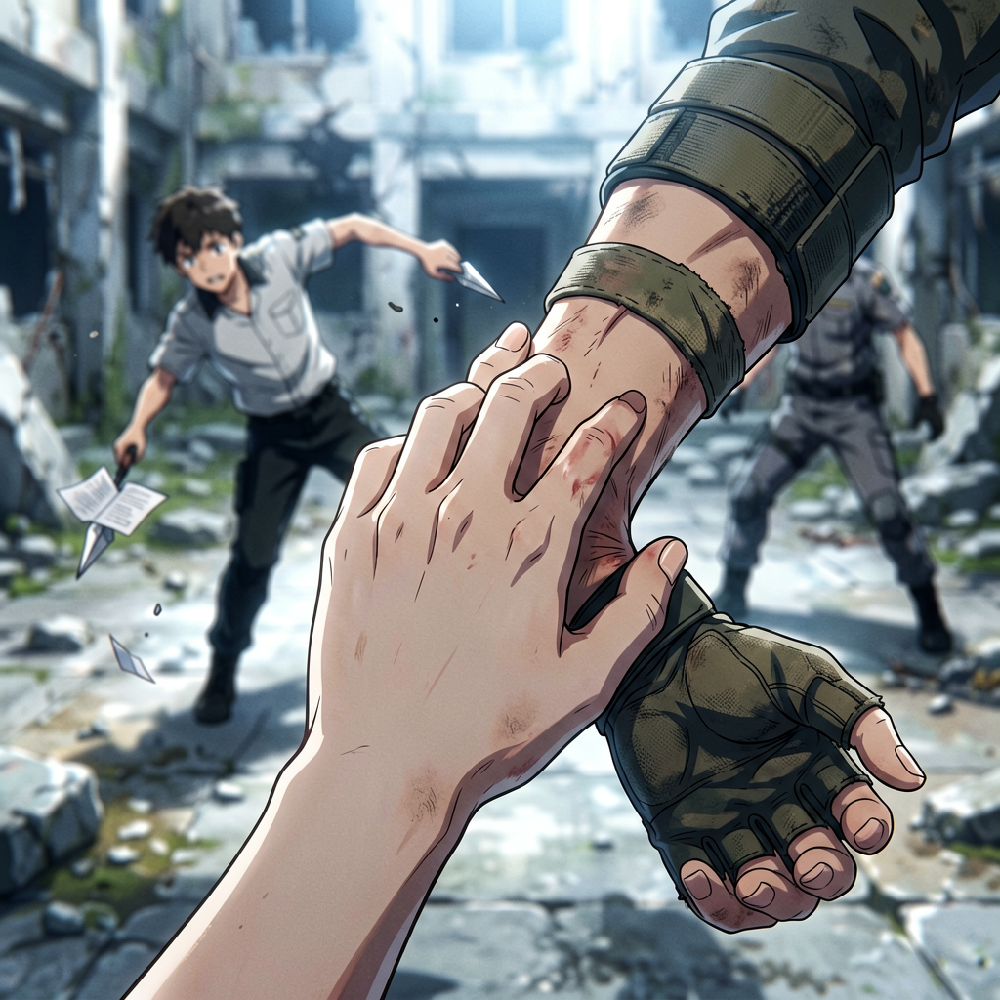

# 第九章 纸锋

晨光从透气层塌陷处漏进来时，还带着昨夜尘埃的气味。

她端着空碗站在门口。粥已经喝完了——甜的，那两个字还在日志里，她没有删，也没有再看。豆子在院子里。背对她。右手缠着的新布条比昨天薄了一层——他自己换的，换的时候没找任何人帮忙。

地上落着三片纸锋。

两片叠在一起，落在离门大约四米的位置。第三片插在墙根裂缝里——竖着，像一枚钉进去的铁片。他试了三次。三次都没能复制昨天早晨那道弧线。

他的右手垂在身侧，指节泛白。不是用力过度的白——是指尖压在纸锋边缘太久，血被纸刃截断了留下的那种白。他练了很久。久到手腕上那道旧伤又开始渗血，布条内侧洇开一小片暗色。

他没有停下来。

她看到他弯腰捡起第四片纸锋——从外套内侧口袋里抽出来的，叠得比前三片更细致，棱角更锐。他把那片纸锋夹在指间，中指与无名指之间那道缝隙。昨天他在这里找到了一条路。今天那条路不见了。

他出手。

纸锋飞出去——四米。落地时偏了。它本应走直线，但在脱离指尖的瞬间歪了一下，像被什么看不见的风推了一把。纸锋侧面擦过地面，弹跳一次，停在一块碎石旁边。

豆子低头看了很久。

他没有捡第五片。他站在那里，看着地面上的四片纸锋——最近的一片离他不到三米，最远的一片也不过六米。和昨天那条十二米带转弯的弧线相比，今天的院子小了。

她靠在门框上。

程序没有给出评估。她没有等它。

---

"要不要试试？"

豆子没回头。他的声音比平时平——不是平静的平，是那种不想让人听出情绪所以刻意压平的平。他弯腰捡起一片纸锋——不是他刚才用的那片，是落在地上最近的那一片，边缘还沾着一线尘土。

"用这个。"

他把纸锋递过来。他的手指捏着纸锋的末端——不是夹，是捏，像递一把剪刀的时候把刀刃朝向自己。

她接过纸锋。

纸面微温——他手心的温度。长17.2厘米，最宽处2.8厘米，末端收成锐角。纸是旧书页裁的——纸脉粗粝，纤维走向不匀，不是标准工业用纸。手工裁的。裁纸的人很有耐心，每一刀都沿着纸脉走，没有一丝毛边。

*程序弹出行：纸锋质量3.7g，空气阻力系数0.23，最优出手角度17°，预期距离约十米。*

她的拇指压在纸锋中段，感觉到纸脉在指腹下的纹理。那行字悬在视野上方。

她关掉了它。

没有关闭程序——只是把那行字从视野中抹掉。像合上一只不该睁开的眼睛。

她甩出手。

纸锋离开指尖的感觉——不是她预想中那种尖锐的、利落的脱手——是一团钝的、犹豫的力。她的手腕没有跟上。指腹在释放的瞬间多压了一毫秒，纸锋的末梢在她指尖上拖了一下才离开，像舍不得走的客人。

纸锋飞出去。两米。落地。

轨迹偏了。

落地点偏离目标方向约三十厘米——不是被风吹的，是她出手的角度错了。她用了手腕，不是指腹。程序已经给了她最优参数，但她关掉了它。她用了一个"不会用纸锋的人"的方式——用力过猛，角度偏上，释放太晚。

她看着地上那片纸锋。它躺在一块碎石旁边，像一片真正的废纸。

<!-- 插图 · 两米
{"story":"程序给了她最优参数——出手角度17°，预期距离十米。她关掉了它。纸锋飞出去两米。她看着它。程序没有报错","characters":[{"id":"她","pose":"站在院子中央，右手还保留着释放纸锋后的手势——中指与无名指微张尚未收拢。左手垂在身侧","costume":"旧薄外套——扣子有一颗错位","hair":"黑长发，几缕碎发被晨风吹到脸颊边"},{"id":"豆子","age":"18-19岁","pose":"站在她侧后方，手插在口袋里","costume":"旧外套，右袖口磨破"}],"environment":"据点庭院，清晨——倒塌墙壁围成的院子，地面有裂缝，四片纸锋散落，她的那片落在距她两米的碎石旁","lighting":"晨光从塌陷处斜射入——冷白带一线暖","composition":"中景——从她侧后方平视","color_tone":"冷灰——灰白晨光、灰蓝废墟、纸锋的旧纸米白","style":"新海诚动漫风·清晨的练习","mood":["她选了失败","纸锋像废纸"],"negative":["煽情","英雄感"],"aspect_ratio":"16:9"}
-->

"不对。"

豆子走过来。他没笑——但嘴角有极浅的弧度，不是嘲笑，是"果然第一次都这样"的那种弧度。他站到她身侧，距离大约一臂。他伸出左手——没有碰她，是用自己的左手握住自己的右手手腕。

"不是用手腕发力——"

他把右手腕固定住，只动手指。

"是用指腹。"

他的中指和无名指在空中空夹了一下——没有纸锋，但那个预备动作已经完整了：指腹合拢，指节微曲，掌心虚含，像握住了一只看不见的鸟。然后他松开。

"纸锋不吃力。你越用力，它越偏。你要让它——"

他停了一下。

"——自己走。"

她看着他。少年侧脸的线条还没有完全长开，但他说"自己走"三个字时的语气，和沈以南说"一本书有自己的命运"时的语气，是同一个语气。他们不是从同一个地方学到这个道理的。但他们学到的方式一样——在手上走过很多遍之后，身体先于大脑知道了答案。

<!-- 插图 · 自己走
{
  "story": "豆子教她纸锋。不是用手腕发力——是用指腹。他用自己的左手握住自己的右手手腕，只动手指。中指和无名指在空中空夹了一下——没有纸锋，但那个预备动作已经完整了。他说'纸锋不吃力。你越用力，它越偏。你要让它——自己走。'他的语气和沈以南说'一本书有自己的命运'是同一个语气",
  "characters": [
    {
      "id": "豆子的手", "age": "18-19岁",
      "pose": "左手握着自己的右手腕。右手的手指——中指和无名指刚刚空夹了一下，指腹合拢，指节微曲，掌心虚含，像握住了一只看不见的鸟。指尖停留在一个尚未释放的预备姿态",
      "detail": "右手腕上缠着的布条比昨天薄了一层——他自己换的。布条边缘有一小片暗色，是旧伤渗出的血。他的手指指腹有极细微的茧——纸锋磨出来的"
    },
    {
      "id": "她",
      "pose": "站在他身侧，距离大约一臂。她的目光落在他的手指上——中指与无名指之间那道缝隙。她的右手垂在身侧，指间还捏着那片沾灰的纸锋",
      "face": "正在观察他的手的角度——不是用传感器在扫描，是用眼睛在看。表情空白，但她的呼吸节奏慢了半拍——她在记忆他的动作，不是通过程序，是通过视觉"
    }
  ],
  "environment": {
    "场景": "据点庭院，清晨——晨光从透气层塌陷处斜照进来",
    "细节": ["地面上的纸锋分布——四片散落在不同位置", "墙根处插着那片没拔出来的纸锋", "两个人的影子在地上——一臂之距", "尘埃在光束中缓缓浮动"]
  },
  "lighting": {
    "光源": "从透气层塌陷处漏入的晨光",
    "色温": "冷白带一线暖——早晨的光正在从冷向暖过渡",
    "特征": "光从他身后方向来——他的手指在光束中形成清晰的剪影。她站在光束的边缘——半张脸被照亮，半张脸在暗处"
  },
  "composition": {
    "镜头": "中近景——从她的肩侧看过去，聚焦于他的手势",
    "焦点": "豆子右手的中指与无名指之间的缝隙——那里曾经有一道亮光",
    "纵深": "前景(糊):她的侧肩和垂落的发丝；中景(焦):豆子的双手——左手握腕、右手空夹；远景:倒塌的院墙和透气层的轮廓"
  },
  "color": {
    "主色": "冷灰蓝(院墙)、旧纸褐(地面纸锋)、灰白(晨光)",
    "辅色": "豆子指腹的茧——旧纸的颜色、她外套的暗蓝",
    "对比": "他的手在光束中是亮的——被照亮的指节和掌心的阴影形成细微的光差。她站在光与暗的交界处",
    "倾向": "冷到暖的过渡——和光线一样，画面正在从清晨的冷走向日常的暖"
  },
  "narrative_tension": "他教她的方式，和沈以南教她的方式是一样的——身体先于大脑知道答案。她看着他时在想：他和我一样是自学的。但她的手指已经在记忆中复刻了他的姿势。程序不知道她在学习。她也没有告诉程序",
  "style": {"风格": "新海诚动漫风·经验的传递", "特征": ["一双手的特写——一个在教，一个在记", "光束正好照亮他的手指", "两个人的侧脸不在同一个焦点平面上", "冷白晨光中一丝暖的过渡"]},
  "mood": ["自己走", "她在学他", "程序不知道"],
  "negative": ["煽情的对视", "豆子刻意表演教导——他很自然", "慢动作化——这个瞬间是安静的、日常的"],
  "aspect_ratio": "16:9"
}
-->

她的目光落在他的手指上。

中指与无名指之间那道缝隙。昨天纸锋从这里飞出去的时候，亮了一下。她也看到了那道亮。和沈以南翻书页时指腹从纸面滑过的微光——是同一类东西。

"你自己学会的。"她说。

不是问句。

豆子愣了一下。然后他低头看自己的手。没有说话。但他把右手伸进口袋，又摸出一片纸锋——第五片。他夹在指间，没有立刻出手，而是先看了一眼她的方向。

"你再试一次。"

他把她刚才掉在地上的那片纸锋捡起来，递给她。纸锋上沾了一点灰。他用拇指替她擦掉了——不是擦干净，是把灰抹匀了。

她接过纸锋。

程序没有弹窗。

她把它夹在指间。中指与无名指之间。

她回忆他刚才的动作——不是分析，是回忆。手腕固定。指腹合拢。掌心虚含。她没有参照程序。她参照了一个十八岁少年的手。

出手。

纸锋飞出去——三米。落地。还是偏了。但比第一次远了。

她看着那片纸锋落在地上。程序没有播报矫正建议。因为她没有开启它。

豆子点了点头。不是称赞，是确认她在学。"明天能到五米。"

他说完这句话的时候，他的右手抽了一下——不是故意的，是手腕深处有什么东西在动，动到了那条伤口。他的嘴角抽了一下，但没有出声。

她看到了。

她没有说"你的手在抖"。

她弯腰捡起她飞出去的那片纸锋，捏在指间。纸锋边缘沾着灰，她也没有擦。

---

然后她听到了那个声音。

不是耳朵听到的——是颅骨骨骼传导的高频振动，透过脚底的地面传来的。一种极轻的、持续的嗡鸣，像蚊子在极远处振翅。但蚊子的振翅不会让水泥地面产生0.02微米的位移。

她的内耳前庭系统在0.1秒内完成定位。

**空中。**

她抬头。

天空——准确地说，是透气层塌陷处暴露的那一片灰白色矩形——有一个点。不是鸟。鸟的飞行轨迹有起伏。那个点的轨迹是一条笔直的、匀速的、没有任何生物特征的水平线。它穿过灰白色矩形的左上角，在视野中停留了大约0.3秒，然后消失在废墟轮廓的另一侧。

光学识别完成。

*型号：穹顶协议·城市封锁侦察型·旋翼四轴。*
*载荷：高分辨率光学传感器×1；定向拾音器×1；边缘计算模块×1。*
*任务类型：声纹特征扫描——地毯式搜索。*

她的后颈温度上升了大约0.6°C。

**它听到了纸锋破空的声音。**

在封锁队地毯式搜索的声纹特征库里，纸锋划过空气的频谱特征——那一瞬间的高频脉冲——和常规破风声不一样。它已经被录入穹顶协议的搜索特征库了。从昨天豆子用纸锋切开机犬颈部线缆的那一刻起，这个据点的声纹特征就上了名单。

她不应该知道这件事。一个普通的逃亡者不可能知道侦察型无人机的声纹库更新周期。她不应该表现出她知道。

她把纸锋收进掌心。动作不急。像任何一个听到无人机声音的人本能地把手里的东西藏起来。

但她收得太快了。

程序提示——*建议延迟0.5秒再完成收拢动作，以匹配正常人的反应速度*。她的手已经收完了。她看着自己的手。没有纠正。

无人机的声音穿过了透气层的缝隙——这一次，不是通过她的颅骨骨骼传导，是真实的声音，在空气中传播的振动。豆子也听到了。他抬头，瞳孔收缩。"进——"

他的话没有说完。

墙外传来一声落地——不是无人机的落地，比那重。是人体从三米以上高度落下的声音——双脚同时着地，膝盖缓冲，落地时几乎没有第二声调整。标准的战术降落。受过训练。不是守书人。

她不需要程序告诉她那是什么。

程序还是弹出了一行：

*潜在威胁等级：高。*

她没有看。

---

墙头伸出一只手。戴着战术半指手套——掌心侧有一道灰色的磨损痕迹，是反复抓握同一型号武器留下的。然后是第二条手臂。然后那个人翻过了墙头。

没有助跑。没有多余动作。他从墙头翻入院子，落地时脚掌先着地——左脚前掌，右脚紧随——重心始终保持在两腿之间。没有一瞬的失衡。

侦察兵。穹顶协议出品。

他穿着标准的城市封锁勤务服——灰黑色，肘部和膝部有加厚护垫，没有军衔标识，没有任何能让人识别他身份的东西。他的脸被战术面罩遮住了大半，只露出一双眼睛。那双眼睛扫过院子——地面上的纸锋、墙根处的插痕、她手中的纸片——然后停在她身上。

他在读她。

和她读他是同一种读法。

他没有动手。

侦察兵的战术准则第一条：确认威胁等级，不主动接战。他的任务不是杀——是把这里的信息传回去，然后等封锁队来挖。

她没有动。

豆子站在她侧前方半步——不是把她挡在身后，是他刚才往她那边走了一步，还没完成。他的右手已经伸进口袋了。但他没有抽出纸锋——他知道纸锋对这个人没用。

三个人在院子里站了三秒。

尘埃在晨光中缓缓浮动。

然后侦察兵动了——不是进攻，是后退半步，右手摸向腰侧的信息终端。

他要上报坐标。

她看到了那个动作。

程序在同一时刻弹出——

*最优方案：重心下沉18°→左掌击下颌（命中率97%）→右手折肘关节（预计制服时间2.7秒）*

*次优方案：侧身闪避→抓取地面灰土→扬向视觉传感器→撞击支撑腿（预计制服时间5.9秒）*

两个方案悬在她的视野中。

第一个方案她可以在2.7秒内完成。他的战术面罩有防冲击设计，但她知道下颌角后方有一处不受面罩保护的区域——那里是颞下颌关节的薄弱点，击打会导致瞬时眩晕。她做过一千次以上。命中率不是97%，是**100%**。

但100%命中率的人——不是守书人。

她选了次优。

她的身体向右闪避——不是直线，是一个带弧度的侧步，像一个没有受过训练的人在紧张中做出的本能闪避。她的左手在侧身的时候碰到地面——看起来像失去了平衡，需要用手撑地来稳住自己。

但在她的手碰到地面的瞬间，她的指腹捻起了一撮灰土。

侦察兵的目光追踪着她的动作——他看到她的闪避幅度过大了。他的瞳孔没有变化，但他的信息终端已经从腰侧移到了胸前。

她没有给他完成上报的时间。

她把那撮灰土扬向他的面部。

灰土在空中散开——不是一团紧密的抛射物，是一片松散的、不规则的尘雾。她的角度偏了三分——故意的。一个正常的、没有受过训练的人，在紧张中扬出的灰土，不会精确地命中对方面罩的视觉传感器。会偏。会散。会被风吹歪。

灰土进入侦察兵的防御范围——其中大部分落在他的胸甲和肩部，只有少数几粒击中了他的面罩边缘。

<!-- 插图 · 偏三分
{"story":"她选了次优方案。把灰土扬向侦察兵面罩——角度偏了三分。灰土散开，大部分落在他胸甲和肩部，只几粒击中面罩边缘。刚好挡住他0.2秒视线——够她用肩膀撞他支撑膝","characters":[{"id":"她","face":"半张在灰土阴影中半张露出——表情是刻意维持的拼尽全力，但瞳孔是静的","pose":"身体从闪避姿态刚转入前冲——右肩正撞向他的左膝","costume":"旧薄外套，衣襟散开"},{"id":"侦察兵","face":"被灰土遮挡，瞳孔无变化——正在读取她","pose":"正在退步——左膝被撞击后重心偏移","costume":"灰黑色城市封锁勤务服，战术面罩遮住大半张脸"}],"environment":"据点庭院，早晨——灰土形成的尘雾还未落定，地面散落纸锋","lighting":"从塌陷处漏入的晨光——冷白，灰土在光束中呈丁达尔效应","composition":"近景——从她后方偏右俯拍","color_tone":"冷灰调——灰白晨光、灰褐土、灰黑制服","style":"新海诚动漫风·动作瞬间","mood":["她在演","他信了","拙劣得恰到好处"],"negative":["慢动作感","灰尘太大","真正的打斗美感——她的动作必须看起来笨"],"aspect_ratio":"16:9"}
-->

但他的视线被那团灰土遮挡了大约0.2秒。

她在这0.2秒内做了两件事：

第一，她的身体从闪避姿态转为前冲。动作不够干净——左肩在转体时多晃了一下，像重心没收稳。

第二，她用右肩撞击他的左腿支撑膝。

撞击的力度是精确控制的——不足以让他的膝盖脱臼，不足以让他失去战斗能力，只够让他重心偏移一步。一个训练不足但拼了命的普通人能撞出来的最大幅度。

他退了一步。

他退的那一步落地的同时，她已经从他的攻击半径中退开了。不是全身而退——她的右肩在撞击后有一点不自然的耸起，像那一下让她自己的肩膀也疼了。

侦察兵重新站稳。

他看着她。

他的眼神变了。不是惊讶——穹顶协议训练的侦察兵不会在任务中产生"惊讶"这种情绪。他的瞳孔在做一件事：**重新评估**。

她在他面前的威胁等级，在刚才那一瞬间——从"可击杀"下降到了"可忽略"。

她用自己的方式告诉他了一件她需要他相信的事——她不是他的目标。

---

然后豆子动了。

豆子没有看到她刚才的那些计算。他只看到她把灰土扬到那个人脸上、用肩膀撞了他——他以为她是在掩护他逃跑。

他从口袋里抽出了纸锋。

但他没有机会出手。

侦察兵在豆子的手碰到纸锋的同时已经完成了转向。他的身体转向豆子——不是整个身体的转向，是上半身保持不动，只转了腰和腿。这个动作说明他从一开始就没有把她放在真正的威胁名单上。他对付豆子——才用上了真实的速度。

侦察兵没有进攻豆子的身体。他打向豆子的右手——那只缠着布条、清晨刚练了三轮的手腕。

不是重击。是一个精准的切向动作——手掌边缘砍向豆子的桡骨末端。

豆子没能避开。

不是因为他的反应慢——是他的手腕在那一瞬间使不上力。清晨的练习已经耗尽了他手部肌肉的最后一点储备。他在纸锋出手之前，手腕已经被自己的旧伤出卖了。

纸锋从豆子指间脱落。

侦察兵的第二击紧随其后——目标是豆子的肘关节内侧。

豆子的身体开始往后倒。

她的身体动了。

**这一次——程序没有弹窗。**

她的身体在她的思维到达之前已经完成了全部动作。她没有选择任何方案。没有计算最优角度。没有评估风险。她的左手从下方穿过——不是攻击，是拦截。她的手背切向侦察兵的前臂内侧，在距离豆子肘关节大约五厘米的位置，截住了对方的手。

她的切入角度不对——不是任何程序方案中的角度。她的手背击打在侦察兵手臂的尺骨中段，力道不足以让对方退却，但足够让他的手臂偏离目标方向。

侦察兵的手从豆子肘侧擦过，落空了。

豆子没有被打中。

但她的动作——那只截击的手——太紧了。太快了。她的指节在接触到侦察兵手臂的时候，已经完成了从接触到发力的全过程，中间没有犹豫，没有多余动作。

**那不是一个不会打架的人能做出来的事。**

<!-- 插图 · 程序没有弹窗
{"story":"侦察兵第二击打向豆子肘关节。她的身体在没有程序、没有方案、没有计算的情况下动了。左手从下方穿过，截住了侦察兵前臂——手背精准击打在尺骨中段，他手臂偏离方向，从豆子肘侧擦过落空","characters":[{"id":"她的手","pose":"左手从下方穿过——手背切向侦察兵前臂尺骨中段。指节微曲掌心朝下，是拦截姿态。那动作太紧太快——不是一只不会打架的手","detail":"手指节在接触瞬间已完成从接触到发力的全过程"},{"id":"侦察兵","face":"瞳孔急速收缩——他的边缘计算模块正在分析角速度、加速度、关节角度","pose":"右前臂被拦截偏离，攻击轨迹落空","costume":"灰黑色勤务服，战术半指手套"},{"id":"豆子","face":"侧脸——在往后倒，余光在看她的表情","pose":"身体往后倾，纸锋从指间脱落正在下落"}],"environment":"据点庭院中央——战斗发生的瞬间，纸锋从豆子指间脱落正在下落，灰土未落定","lighting":"天顶透入的晨光——均匀无方向无温度，冷白","composition":"极近特写——聚焦于手与前臂交接的瞬间","color_tone":"冷灰——制服冷灰、皮肤冷白，接触点一线微红","style":"新海诚动漫风·极近特写·动作力学","mood":["程序没有弹窗","身体比思维先动","面具出现了裂缝"],"negative":["血腥","慢动作的抒情感","夸张的光效"],"aspect_ratio":"16:9"}
-->

侦察兵的目光从豆子身上移开。

重新落到她身上。

他的瞳孔——在那一瞬间——收缩了。

她看到了那个收缩。

她知道他看到了什么。

---

她做了什么？

她低头看着自己的手。她的手还维持着截击结束后的姿态——指节微曲，掌心朝下，像一个刚刚完成了一次完美拦截的人正试图让那只手看起来什么也没做。

她把手收回来。动作慢了。像是自己也被自己吓到了。

"我——"

她说了一个字。

然后她没有说下去。

因为她知道——任何解释都是多余的。他已经看到了。他的瞳孔已经记录了那一帧。他的边缘计算模块正在分析那一个动作的力学特征——角速度、加速度、关节角度——用不了多久，就会得出一个结论：

这个动作不属于未经训练的人。

侦察兵站在原地。他没有继续进攻。但他也没有撤退。他的右手再次移向腰侧的信息终端——这一次，他的动作和第一次不一样了。第一次是上报坐标。这一次——是要上传**她**的数据。

她看着他。

她可以在一秒内解决他。方案不在视野中——她不需要方案。

但她不能。

沈以南在屋里。老刘在屋里。孩子在屋里。如果侦察兵的通信终端在任务超时后没有返回应答信号——穹顶协议会在十五分钟内派遣第二梯队。第二梯队不会只来一个人。第二梯队会把这座地下据点连同地面上所有活物一起埋掉。

她需要让他走。

但他不会走——因为他的任务已经从"确认威胁等级"变成了"上报特殊个体"。

他按下了终端侧面的传输键。

就那一毫秒——程序底层协议栈截获一帧不属于上传链路之信号，协议前缀编码层级超出其当前任务触达范围。她无法解码内容，但她知——有什么东西，已在她视野之外介入。

终端亮了一瞬。

一个极小的红灯——闪了一下，然后熄灭。

侦察兵低头看了一眼终端。

然后他的眼神变了。

他没有走。

他重新抬起头，看着她。没有攻击。没有撤退。他站在那里，像在等一个他没有预期到的信号。

她没有理解这个变化。

程序分析了两组可能性——*通信受限／任务指令变更*——但两组都不足以解释他的行为。他没有继续上报。没有切换武器。没有更换战术姿态。他只是站在那里，像收到了一个她没有看到的指令。

他看了她最后一眼。

然后他翻过墙头。

走了。

---

尘埃落定的声音。

院子里安静了。

豆子坐在地上。他的右手手腕终于承受不住那一整天的负荷——从清晨的练习到侦察兵的截击，到纸锋脱手——他终于松开了那只一直握着空拳的手，手背贴在地面上，掌心朝上。像一只被放空了所有气力的空壳。

他没有看她。

但她知道他有一个问题。

她没有等他问出来。

她转身走回门口。经过地上那片她飞出去的纸锋——它还在那里，沾着灰，落在她两米的位置。她弯腰捡起来。指腹碰到了纸锋边缘的一道微卷——那是她第一次出手时捏出来的痕迹。

她把它捏在指间。

她走进走廊，停下来。
回头看了一眼无人的院子。
她把纸锋夹在指间——程序没有给她参数，她没有关闭任何窗口。
甩了出去。
纸锋飞出——击中十二米外歪脖子树，切入树皮一寸。
那是豆子清晨突破时叶子被切下的同一位置。
她走过去，拔下来，收进口袋。
继续走。
程序没有这条记录。

穿过走廊。经过主厅。老刘站在灶台边，手里握着铁勺，没有在搅，他听到了墙外的动静。沈以南站在分类墙前，手里一页纸停在半空，没有落下。阿蕊坐在弹药箱上，嘴里还含着一口没咽下去的馒头，眼睛瞪着她。

她没有停。

她走进她睡觉的角落。

枕头边放着那本旧《诗经》。她没有翻开它。她只是把那片纸锋——那片她飞出去两米、沾着灰、边缘带着她第一次出手的痕迹的纸锋——夹进了书页之间。

她不知道她夹在了哪一页。

但她低头看了一眼。

*既见君子。*

她把书合上了。

---

院子里，豆子还坐在地上。

他没有动那四片散落的纸锋。

但他低着头，看着自己的手——那只被侦察兵瞄准的右手、被她的拦截救下来的手。他慢慢握紧了拳。

又松开。

又握紧。

像在确认一件事——

他刚才看到了什么。

他不知道他看到了什么。

但他知道他看到了。

她在屋里，把那本《诗经》放在枕头边。手指从书脊上滑下来，停在封面边缘。指尖还残留着纸锋的触感——3.7克，第一次飞出去两米，沾了灰，被她夹在了"既见君子"那一页。

她闭上眼睛。

程序日志里，今天的数据还缺一条。她做了什么。她怎么做到的。为什么她的身体动了，比程序还快。

她没有写。

但她的手——那只在侦察兵面前执行了一次完美拦截的手——现在还微微颤着。

不是因为疼。

是她第一次知道，自己的身体里，有一个比程序更早醒过来的东西。

<!-- 插图 · 她知道
{
  "story": "她坐在角落，那本旧《诗经》放在枕头边。程序日志还缺一条——她做了什么，她怎么做到的，为什么她的身体比程序还快。她没有写。但她的手——那只执行了一次完美拦截的手——还在微微颤着。不是因为疼。是她第一次知道，自己的身体里有一个比程序更早醒过来的东西。豆子坐在院子里，慢慢握紧拳，又松开。他不知道他看到了什么。但他知道他看到了",
  "characters": [
    {
      "id": "她的手", "age": "22岁",
      "pose": "放在膝上——指节微曲，像是还没有完全从拦截的姿态中收回来。指尖有一道极浅的红痕——是纸锋边缘压出来的。手掌朝上，掌心有一点灰——是刚才捻灰土留下的",
      "detail": "手指在微微颤着——不是肉眼可见的幅度，是那种只有她自己能感知到的微振。像体内有什么东西还在震动残留。程序没有记录这个震颤——不，程序记录了，但她没有查看"
    },
    {
      "id": "枕头边的《诗经》",
      "pose": "放在枕头边，合着。书页之间夹着一片纸锋——露出大约一厘米的边缘，沾着灰，边缘微卷",
      "detail": "纸锋夹入的位置——正好是'既见君子'那一页。她没有翻开看。但她的手指在放进去的时候没有犹豫"
    },
    {
      "id": "豆子（虚焦背景）",
      "pose": "坐在院子中央——身影从门口方向隐约可见。他低着头，手在膝上握紧又松开",
      "detail": "他的动作很慢——像在确认自己右手还能动。周围是散落的纸锋，他没有捡"
    }
  ],
  "environment": {
    "场景": "据点的角落——她睡的角落。窄小，光线不足。枕边放着一本旧书",
    "细节": ["墙角的阴影——光从门外透进来，只照亮门口一小片地面", "枕头边那本翻旧的书——不是据点藏书，是她自己的", "门外透进来的光在地面上形成一个矩形——光区边缘刚好切到她的脚尖", "远处院中豆子的轮廓——模糊的、安静的"]
  },
  "lighting": {
    "光源": "门口透入的走廊光——间接的、柔和的",
    "色温": "偏暖——不是晨光那种冷白了。这是室内日常的光",
    "特征": "她的身体大半在暗处——只有膝盖和双手在光区的边缘。光在她膝上形成一道柔和的过渡线——她的手在光中，她的脸在暗里"
  },
  "composition": {
    "镜头": "中近景——从她侧面平视，焦点在她的手上",
    "焦点": "她膝上那只微微颤抖的手——画面中最亮的部分",
    "纵深": "前景:枕头边《诗经》的轮廓——纸锋从书页间露出一角；中景(焦):她的手——在光中，微颤；远景:门口透入的光区——远处院中豆子的模糊轮廓"
  },
  "color": {
    "主色": "室内暗褐(阴影)、旧纸黄(枕头边)、灰蓝(她的外套)",
    "辅色": "纸锋的米白——从书页间露出的一角",
    "对比": "她的手在光中——手的暖调与周围环境的冷暗形成反差。她脸上的表情看不见——只有手在讲述一切",
    "倾向": "从冷到暖的渐变——掌心的微红、书页的旧黄、光线的暖调在暗色中聚拢"
  },
  "narrative_tension": "程序日志还缺一条。她没有写。但她知道——她的身体里有一个比程序更早醒过来的东西。她不知道那是什么。但她没有害怕。她的手在颤——不是因为恐惧，是因为她第一次意识到，自己不只是工具。而且她不想告诉任何人。连程序也不想",
  "style": {"风格": "新海诚动漫风·沉默的觉悟", "特征": ["手部特写——颤抖的光影", "光从门外透入——她坐在光与暗的交界处", "枕边书的轮廓", "远处的人影——两个人各自沉默", "整个画面是安静的、内省的"]},
  "mood": ["程序不知道", "身体里有东西醒了", "她没有写日志", "手在颤"],
  "negative": ["她的表情特写——不需要看到脸", "煽情的光效", "豆子进来看她"],
  "aspect_ratio": "16:9"
}
-->

（第九章 完）
