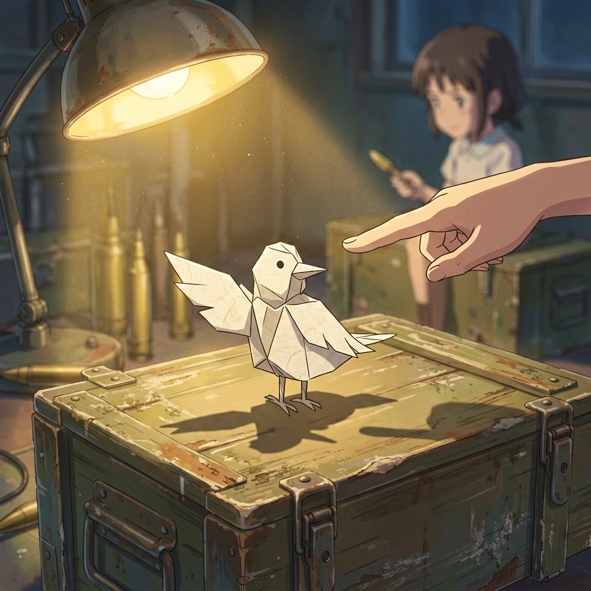
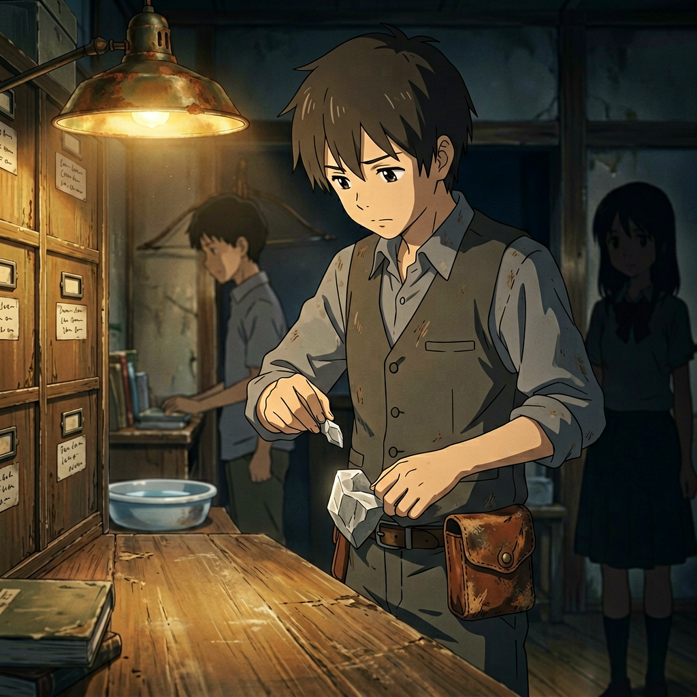
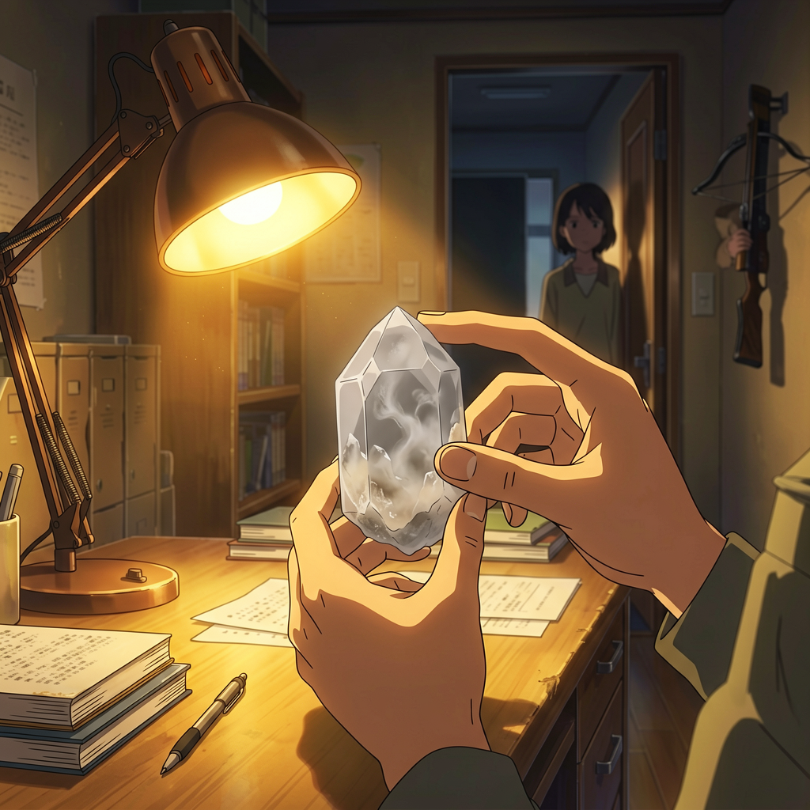

# 第十章 纸鹤

午后不知何时过去的。

据点里没有窗。光从墙角那盏铁皮灯里来，还有透风层裂缝漏进来的一线——不是天光，是外面灰蒙蒙的午后从混凝土裂缝里挤进来，在地面上拖成一条窄窄的灰白色带子。她坐在分类墙旁边的弹药箱上。没有在看书。没有在清点物资。没有在做任何事。就坐在那里。

程序在视野右下角挂着一行等待状态：

> *未处理日志条目：1条。*

她没有点开。那条日志她知道是什么——"拦截行为分析"。她不需要程序告诉她她做了什么。

主厅里没有人说话。豆子靠在对面的墙边，闭着眼，右手缠着新布条，手腕搁在膝盖上——没有睡。他今天没有练纸锋。她进来的时候他看了她一眼，她没接。他就没有再看了。沈以南在储藏室里，门关着，能听见他翻书页的声音——规律的，隔几秒一页，像脉搏。

安静。

然后她注意到了那个影子。

主厅入口的阴影边缘——那里站着一个人。

不是站了很久。是刚站住。脚尖在门槛内侧停下来的，像走到这里的时候忽然不确定该不该继续走了。阿蕊站在主厅入口的边缘，半个身子还在走廊的暗里，半个身子在铁皮灯光圈的边缘。她正在看她。

目光相遇。

阿蕊没有像平时那样跑过来。没有叫"小满姐姐"。她站在那里，两只手交握在身前——手里攥着什么东西，看不见。

她看着阿蕊。

阿蕊没有避开目光。但也没有走过来。

她们之间隔着一整个主厅的距离。大约七步。阿蕊通常跑过来只需要三秒。今天她站在七步之外，停住了。

她回视。没有说话。

然后阿蕊动了——不是跑，是走过来。步子比平时小。每一步都踩实了再迈下一步，像走一片不确定能不能承重的冰面。她走到距离她大约一臂的位置，停住了。

没有坐下。

没有像上次那样挨着她的肩膀蹲下来。

站在那里。

"小满姐姐。"

声音是平的。不是不高兴，是在试探——先喊一声，看对方是什么反应，再决定下一句话怎么说。

"嗯。"

阿蕊看着她。那双眼睛在铁皮灯光里显得格外大——不是因为恐惧，是因为专注。她在读她的脸。一个七岁的孩子，正在学怎么从一个不回答的人脸上找到答案。

"昨天那个人——" 阿蕊说。

她没有接。

"那个灰衣服的。"

她维持着面部不动。没有点头。没有摇头。没有给出任何可以读取的信号。程序告诉她：*建议微表情管理——眉毛放松，嘴角维持当前状态*。她不需要建议，她已经在做了。

"他不会再来了，对吧？"

阿蕊的声音在句末往上走了一下。不是问号——是假装自己知道答案，但不确定，所以偷偷在句子末尾留了一道缝，让对面的人可以补进去一个"对"字。

她看着她。

她应该说"对"。话到嘴边的时候，程序没有弹窗。她自己决定了一个字的答案：

"不会了。"

阿蕊点了点头。动作很小——像终于确认了一件事，但还有别的事没确认。她没有走。她还站在那里，手还攥着那团东西。

"你怎么知道的？"

问题来了。

一个孩子问出来的，最直接的问题。她的逻辑链条很简单：你说他不会来了，你一定知道为什么。如果你知道——你就是做了什么。

她不能回答。

她可以说"猜的"。但一个七岁孩子刚经历过一次战斗警戒，她在门口看到了所有人如临大敌的样子——她不会相信这是猜的。

她需要一个看起来合理的解释。

"他在外面站了很久。没进来。站够了就走了。"

一句谎话。那个侦察兵翻进了院子，交手了，走了。阿蕊不知道——当时她在 bunker 里。但豆子知道。她侧眼看了一眼豆子——他仍然闭着眼，但耳朵的方向动了。

阿蕊在消化这句话。然后：

"那你为什么站在外面？"

她顿了一下。

"什么？"

"豆子哥哥说你在外面。" 阿蕊的声音压低了。不是胆怯——是认真。"你和那个人站了很久。"

她没有回答。

阿蕊还在继续："你是不是——"

"阿蕊。"

她截住了她。声音不重——但足够让那个句子断在那里。阿蕊的嘴唇合上了。

主厅里安静了几秒。远处储藏室里传来沈以南翻页的声音。

阿蕊没有哭。没有被吓到。但她没有再问下去。她低下头，看着自己攥着东西的手。

沉默横在她们之间——不是空的，是满的，满到溢出来就成了这层谁也捅不破的安静。

她看着阿蕊垂下去的脑袋。碎发从耳后滑下来，遮住了半边脸。那双手还攥着那团东西，指节发白。

她开口：

"你手里拿的什么？"

话题转了。阿蕊知道她在转。但她没有戳破——因为比起追问，她更想让她看自己手里的东西。

阿蕊犹豫了一下。然后把手里的东西展开了。

一张纸。被折过很多次——不是五六次，是几十次。纸面已经起毛了，折痕不是一条一条的，是一团一团的，像一张纸被反复改变主意，那些主意叠在一起，软化了的纸脉再也回不到原来平直的样子，边缘起了细小的纤维。

阿蕊把它举起来。

"我想叠一个东西。叠不出来。"

---

她伸出手。

阿蕊把纸放在她掌心里。纸是温的——阿蕊攥了太久，掌心温度渗进了纸的纤维里。这是一张旧纸，背面有字——油墨印的，是某本书的扉页的一部分。纸裁得不齐，手工撕过的痕迹。应该是一本旧书上裁下来的。

她的指腹碰到纸面的瞬间——她知道了这张纸的状态。

纸脉已经疲劳了。折叠次数太多，纤维断裂率大约百分之六十五。再折下去，每折一次，断裂率都会上升。最优方案是换一张新纸。沈以南的抽屉里有干净纸。

她没有换。

她把纸捏在指间。

她的手指开始动——不是自己动的，是她让它们动的。第一折，对折。她指腹找到纸的中线，准备压下去——准备用她惯常的力度，精确的、笔直的、一刀切下去的折法。

但在指腹即将加压的瞬间，她停住了。

她知道——如果她用那种力度压下去，这条折痕会是一条完美的直线，但纸会裂开。沿着纸脉断裂率最高的那一道暗伤——就在中线偏右大约七毫米的位置——会从那里撕开。

她需要折轻一点。

她的手指悬在那里。她看着自己的手——它在等一个指令。一个关于折叠力度的参数。程序没有弹出，但她知道参数是多少：*最优力度：0.3N。纸断裂阈：0.5N*。

她不能用那个力度。

她需要用——轻的。

她不知道"轻"是多少牛顿。

她压下去。比平时轻。不是0.3N，是她的手指自己选了一个比0.3N小的、不确定的数字。折痕不够深。纸没有裂。但折痕歪了——她从第一折开始就偏了。

她的手指继续。

第二折——折角。指腹把纸角折向中线。太轻了，纸角对不准。她再调整一下。又偏了。

第三折。

她的手指在做一件她从来没有做过的事：用错误的力度，折错误的折痕，在错误的材料上，试图做出一只正确的东西。

她每折一下都能感觉到纸脉在指腹下抗议——不是断裂的那种抗议，是软软地、无奈地、吃不住力的那种顺从。纸在听她的话，但她的力气用错了方向。她像在用手术刀削一支铅笔——工具对，人不对，结果是一地碎屑。

她完成了。

她手里的东西——如果她数据库里的"纸鹤"模板有百分之一的相似度——那她手里这个也和它没有任何关系。没有尖喙。没有对称的翅膀。没有站得起来的尾巴。一团软的、不对称的、塌着腰的、说不清是什么的东西。

她看着它。

程序没有弹出任何评估。她也没有打开。

她把那团纸递给阿蕊。

阿蕊接过去。

不嫌弃。不惊讶。她把它翻过来，放在手心里，从各个角度看。从上面看。从侧面看。举到灯下看。

阿蕊没有问"是鸡吗"。

她只是看。

然后阿蕊做了一件她没有预期到的事。

阿蕊把那只纸鸟——如果它算鸟的话——拆开了。手指沿着折痕一条一条地倒着拆，把纸重新展平。那张纸回到平面上，上面布满了折痕——旧的折痕和新的折痕叠在一起，像一个被写了太多遍的草稿纸，再也分不清哪一笔是今天的。

阿蕊把纸翻了一面。重新折。

不是复制她的手艺——阿蕊沿着她留下的折痕在折，但角度不同。她压下去的折痕太浅了，阿蕊在上面加深了一些；有些地方的折痕阿蕊绕过去了，自己另起了一条。小女孩的手指在纸上摸索着前进——比她慢得多，笨得多，但每一步都是自己的。

她看着她折。

阿蕊完成了。

她手里也有一个东西——和她的那个一样不成形，一样不对称。但阿蕊把它竖着立在弹药箱上了。它歪了一下，晃了晃——然后站住了。

"你看。"

阿蕊的声音有一丝极轻的得意，像终于做到了。她把那团不成形的东西放在弹药箱上，松手。它站在那里。没有名字，没有形状，但站着。

"它站起来了。"

她看着它在灯下的影子。歪斜的。小的。但它站着。

---

阿蕊把它从弹药箱上拿下来，装进口袋里。同一个动作——塞进去，拍两下，确认它在那里。

"小满姐姐。"

"嗯。"

阿蕊看着她。那双眼睛在灯下是亮的——不是刚才那种试探的亮，是另一种光。直接的。不拐弯的。

"你不会走的，对吧。"

不是问句。是一个陈述句，在尾巴上加了一个"对吧"，给自己留了一条退路。但阿蕊看着她的时候，那不是一个在问问题的人的表情——那是一个在等确认的人。

她看着阿蕊的眼睛。那双眼睛里装着一个问题——不是昨天那个侦察兵的问题，不是她会什么不会什么的问题。是一个更简单的问题：你会不会像其他人一样消失。

她停了一下。

程序没有给出任何应该回答什么。

她自己开口了。

"不会。"

阿蕊点了点头。然后跑了。辫子在背后甩了一下，脚步声在走廊里远下去，直到听不见。

她一个人坐在弹药箱上。

腿上还有那张纸被拆开后留下的折痕——软的、深的、浅的、歪的，一片乱线，像一张地图，画满了所有她不该走进去但已经走进去了的路。

她把纸边捡起来。没有扔掉。

收进了外套口袋里。

和阿蕊放那只纸鸟的位置——是同一个口袋。

---

她走回自己睡觉的角落。枕头边还放着那把干透了的花——花瓣边缘卷曲成褐色，形状还在。旁边是那本旧《诗经》。

她没有翻开。

她躺下来。

闭上眼。

然后她听到那个声音——不是耳朵听到的，是记忆里翻出来的：阿蕊说"它站起来了"的时候，那一线几乎听不见的得意。

她睁开眼。

程序弹出一行日志——自动生成的：

> *行为记录：纸折叠任务。外部条件：材料已疲劳。最优方案：弃用换新。执行方案：在已有折痕上继续折叠，未达成目标形态。*
>
> *分类：决策偏差。*
>
> *但她问我会不会走。*

她盯着最后那一行。

她能删掉它。

她没有。

她合上日志。窗外没有窗可看。天花板上那道裂缝她知道它在哪里——从东墙到第四根横梁。不需要睁眼。

她闭了一会儿眼。

---

门开了。

阿武走进来。弩在手里——不是挂在肩上，是握着，箭矢已经发射过了。袖口有一道灰白色的尘迹——不是灰，是某种粉末，在灯下泛着极淡的金属碎光。

他走到主厅中央。另一只手里握着一枚东西——很小。灰白色。握着的姿势不像握着战利品，像握着刚从地上捡起来的什么普通物件。他把那枚东西放在桌上。

沈以南在分类墙前面。阿武进门的时候他已经转过身来了——不是在阿武出声之后，是听见脚步的时候就转了。他的目光落在阿武的手上。

手在半空中停了一下。

"墙外那台。" 阿武说。声音不重。像在汇报一件已经处理完毕的事。"从检修口爬上来的。还在往外爬。"

沈以南走过来。从桌上拿起那枚东西——一枚拇指甲盖大小的灰白色晶石。举到灯下。转过一面。再转一面。内部有极淡的光——不是反射，是从内部渗出来的，像一块凝固了的、半透明的雾。

"是昨天那台。"

肯定句。没有疑问。

"线缆集束的切口——" 阿武说，"是昨天那下。有人把它打下去的时候伤了核心。"

沈以南没有接话。他把晶核在指间转了一圈，指腹沿着表面摸索——不是在看，是在感觉。他脸上的表情不是厌恶，不是满足，甚至不是警觉。是一种安静的、疲倦的确认。他以前握过这种东西。他知道它的重量，知道它的温度，知道怎么判断它还能不能用。

"还能用。"

他把晶核放进了腰带上的小皮囊里——不是公用储物箱，是他自己的皮囊。系在左侧胯骨的位置，盖子上有磨损，使用的痕迹。动作流畅。他做过很多次。

阿武看他收好。没有评价。没有追问。

"她呢？"

"在屋里。"

阿武没有再说什么。把弩挂回墙上——右边第二根钉子。位置固定，不需要看。他去了水盆那边洗手。

林小满站在走廊边缘。

不是有意站过去的。是从主厅走回自己角落的时候听见开门的声音，停下来了。半个身子在走廊的暗里，半个身子在铁皮灯光圈的边缘。她看见了全部。

那台书判官掉进检修口的时候她在。豆子问要不要去查看的时候她在。阿蕊坐在她身边折纸鹤的时候——她也在。

现在她站在这里。看着沈以南把那枚晶核收进皮囊里。动作流畅得像肌肉记忆。

她没有走出去。没有出声。

程序没有弹窗。

她看着沈以南走回分类墙前。皮囊在他腰带上垂着。晶核在里面。

她转身。

走回自己的角落。

躺下来。

闭上眼。

程序日志自动生成了一条新条目：

> *情报记录：守书人据点领袖沈以南具备回收墨焰晶核的能力。操作流程：击杀→提取→鉴定→收纳。熟练度：高。*
>
> *触发场景：量产型书判官·序列同昨日检修口目标。死因：核心破损（旧伤）。处理人：守书人·武。*
>
> *晶核去向：沈以南个人储物。*
>
> *备注：她亲眼看到了。*

她看着最后一行。

没有删。

光标在末行末尾闪了一下。

她抬手——不是删除。指腹落在日志末尾，补了三个字。

> *站住了。*

程序没有弹出评估。

弹出了另一个东西。

一个她从没见过的窗口。不是任务日志，不是系统广播。白色窄边框，标题栏写的不是她认识的任务编号："文渊系统·辅助模块建议"。正文就一行字：

> 检测到非标准情绪标记。是否安装情感模块测试版？

她看了大约两秒。

没有点"是"。没有点"否"。

点了窗口右上角的叉。

闭上眼。

走廊那边传来阿武洗手的水声。

（第十章 完）

<!-- 插图 · 纸鹤与晶核
{"story":"纸鹤被收进了口袋。晶核被收进了沈以南的腰带。她两件事都看到了","characters":[{"id":"沈以南的手","pose":"双手在桌面上方——托着晶核举到铁皮灯下。指节微屈，放松有经验","detail":"晶核灰白色半透明，拇指甲盖大小，内部有极淡雾状流动"},{"id":"门框里的影子","pose":"站在走廊暗处——半个身子在光线边缘，半个身子在阴影里"},{"id":"阿武（虚焦背景）","pose":"在画面边缘挂弩——侧面虚焦，动作正在收尾"}],"environment":"守书人据点主厅——书桌前，铁皮灯是唯一光源","lighting":"暖黄——铁皮灯从上方偏左照亮桌面，晶核在灯下呈灰白半透明","composition":"中景——主厅书桌区域略偏沈以南一侧","color_tone":"暖黄褐（灯光/桌面/旧书）、灰白（晶核）、深褐黑（走廊阴影）","style":"新海诚动漫风·叙事性构图","mood":["安静日常","她全部看到","程序不会记录的事她在记"],"negative":["战斗气氛","晶核发光——晶核不发光，是被照亮的"],"aspect_ratio":"16:9"}
-->

  },
  "mood": [
    "纸鹤被收进了口袋",
    "晶核被收进了沈以南的腰带",
    "她两件事都看到了"
  ],
  "negative": [
    "煽情",
    "晶核自身发光（它不是光源）",
    "沈以南的表情——不需要看清他的脸",
    "门框边的影子不能有威胁感——她只是在观察",
    "战斗场面"
  ],
  "aspect_ratio": "16:9"
}
-->

（第十章 完）
