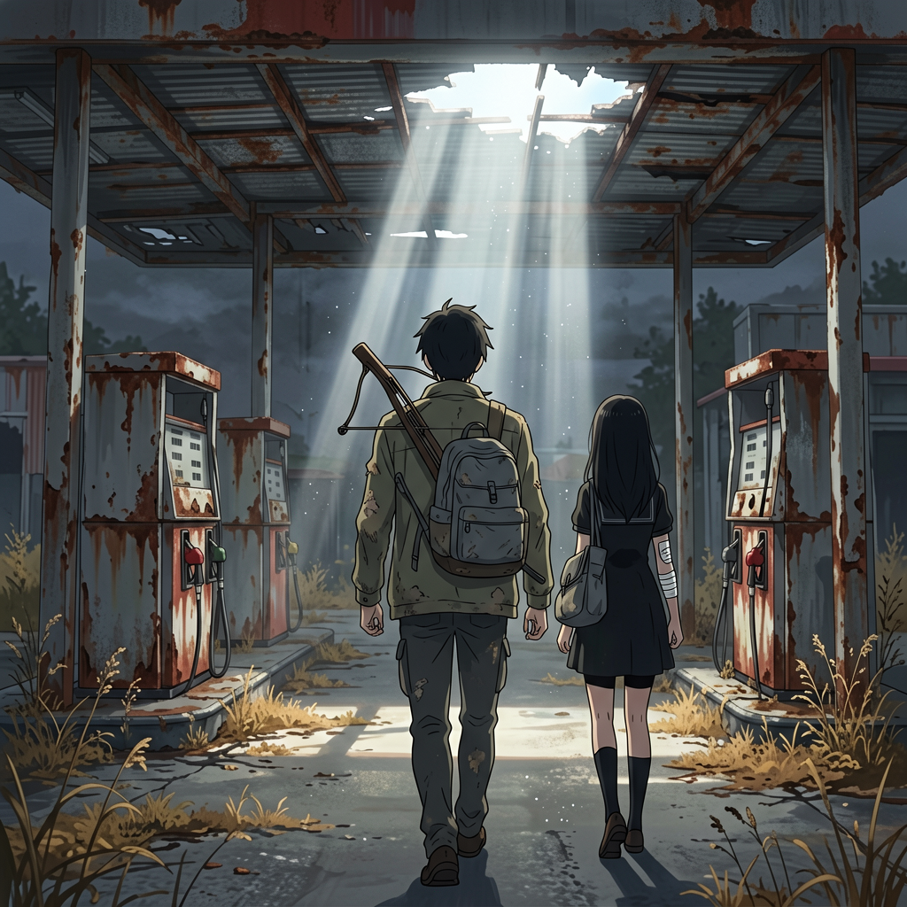
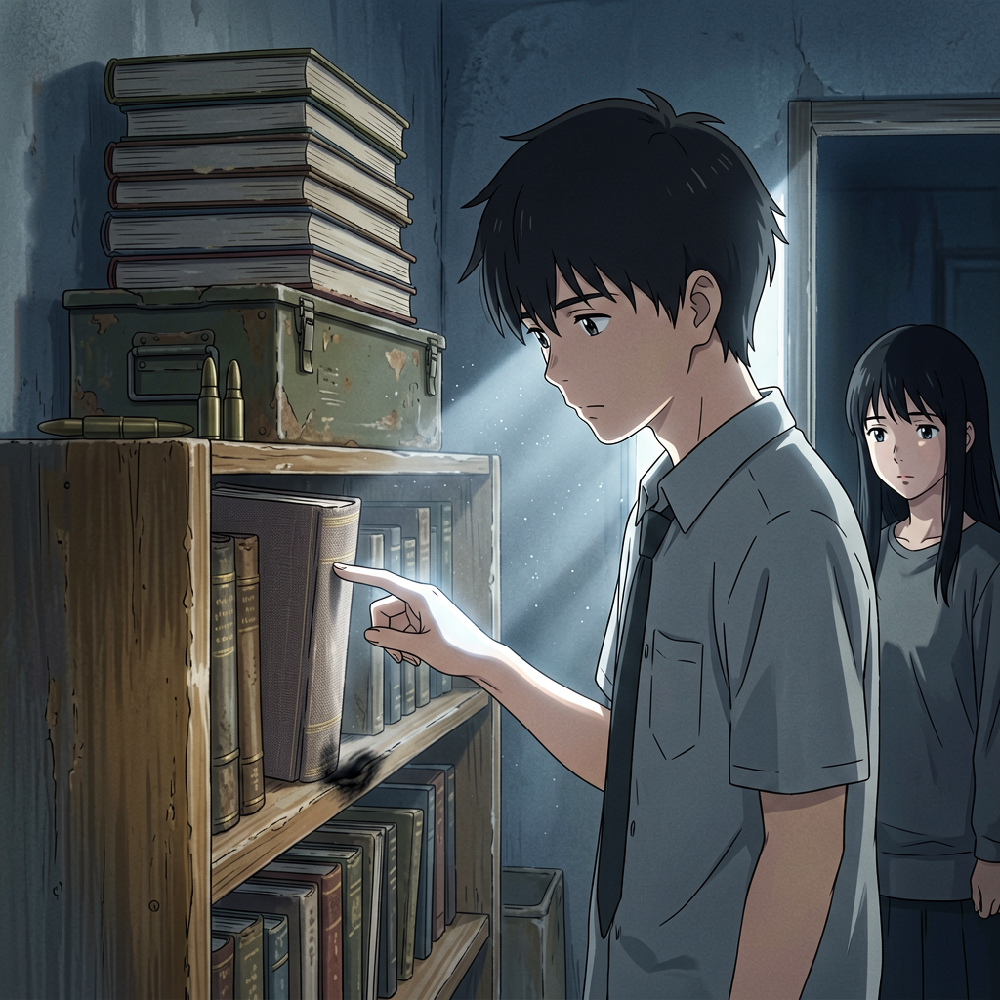
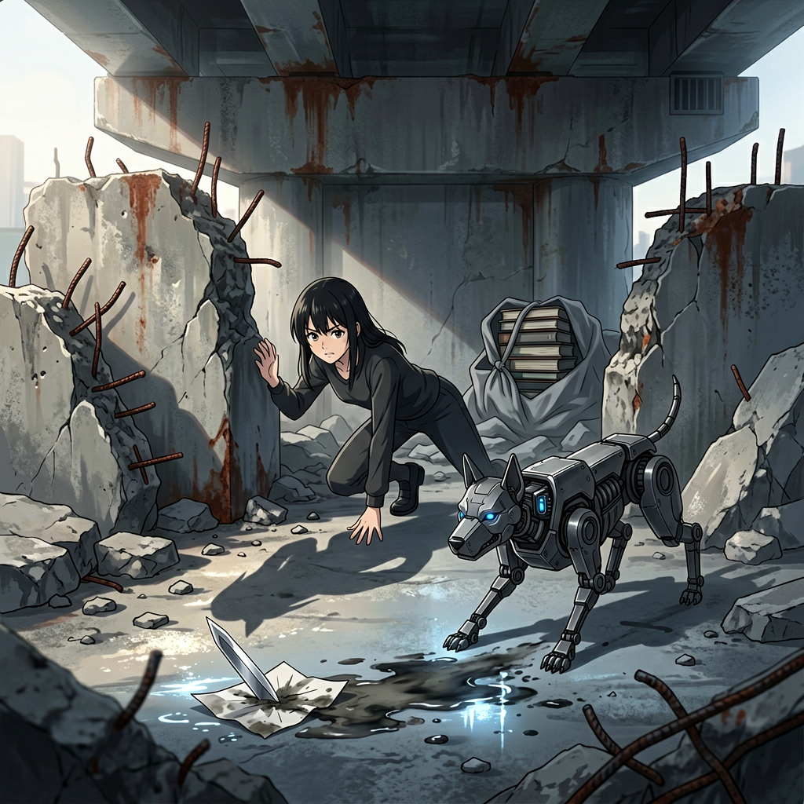
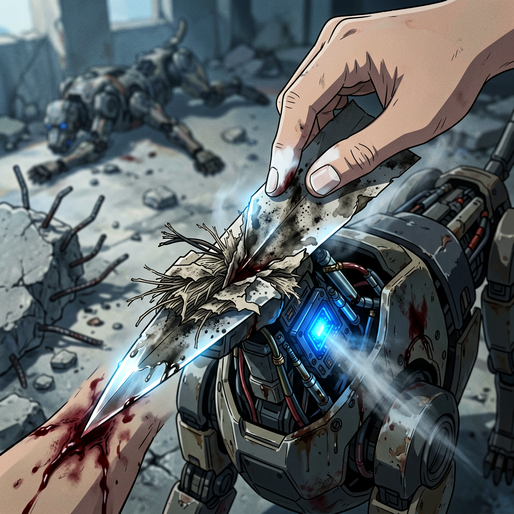

# 第十一章 书在路上

天亮前，封锁队的钻探声又近了。

她没有休眠。天花板裂缝上方，金属钻头反复撞击围护结构——不再是警告。是计时。

然后听到另一个声音——磨刀石上金属滑过的声音。极轻。极稳。

她起身。

阿武坐在后门边的弹药箱上，磨弩箭。面前地上排着十二支箭。

---

沈以南从储藏室出来。没拿书。径直走向墙角那面矮书架。

他在书架前站定。手抬起来。很慢。

食指和中指并拢，指腹贴着书脊的布纹，从顶端滑到底端。

停了一下。

不是停留。是听。

她看到了。程序没有为这个动作生成描述。

第二本。抽出来。翻开扉页。指腹走过一次。合上。放在弹药箱顶上。

第三。第四。五。六。

第七本。

他抽出来时慢了一点点。不是犹豫——是确认。翻到某一页，停了两秒。合上。放在最上面。

程序弹出一条记录：

> *行为记录：守书人首领·沈以南。取书七册。*

她在心里补了一个词——

**他在听。**

<!-- 插图 · 他在听
{
  "story": "沈以南站在书架前。手指并拢，指腹贴书脊布纹从顶端滑到底端——不是在检查，是在'听'。她在背后看着这一幕。程序记录了动作，没有记录'他为什么停'",
  "characters": [
    {
      "id": "沈以南的手", "age": "35岁",
      "pose": "右手食指与中指并拢，指腹贴着一本书的书脊布纹——刚从顶端滑到底端，停在书脊与封面的交界处",
      "detail": "指尖在布纹上停留的位置——那本书的书脊有一道极浅的压痕，是反复触摸形成的"
    },
    {
      "id": "她",
      "pose": "站在门框边——半身在储藏室的暗处，半身在书架方向漏来的光里。没有走上前，没有问。只是看着他的手",
      "face": "表情空白。但她的视线钉在他的手指上——程序没有生成'注视时间过长'警告"
    },
    {
      "id": "弹药箱上的书",
      "pose": "六本已经叠好放在弹药箱顶上——书脊朝向一致，排列整齐。第七本正在被抽出来"
    }
  ],
  "environment": {
    "场景": "据点储藏室——角落书架、弹药箱、磨弩声刚停",
    "细节": ["矮书架——隔板有一处被反复触摸形成的微凹", "弹药箱顶上的六本书排列整齐", "后门外阿武磨弩的金属声已经停了", "天花板裂缝——封锁队的钻探声暂停"]
  },
  "lighting": {
    "光源": "储藏室门洞漏入的光——偏冷，清晨的灰白",
    "色温": "冷白——无人驻地该有的温度",
    "特征": "光从她身后方向来——沈以南的书架在光区边缘，他的手刚好被照亮"
  },
  "composition": {
    "镜头": "中景——从她身后偏右的角度，越过她的肩膀看向书架",
    "焦点": "沈以南的手指与书脊的接触点——画面上唯一有温度的地方",
    "纵深": "前景(糊):她的侧影轮廓；中景(焦):书架、他的手、弹药箱上排列的书；远景:沈以南的侧身"
  },
  "color": {
    "主色": "灰白(晨光)、旧纸褐(书架)、灰蓝(储藏室墙壁)",
    "辅色": "书脊布纹的暗红——破旧褪色但隐约可见",
    "对比": "他指腹压下去的那一点——光恰好落在那里，周围的一切都在暗处",
    "倾向": "冷——画面没有暖色，就像她的程序不会为这个动作生成温度标签"
  },
  "narrative_tension": "他以为自己选书的过程无人注意。她在背后看到了。程序为她生成了一条行为记录——她在那条记录后面自己补了一个词。程序不知道她补了什么。她也不知道自己为什么想补",
  "style": {"风格": "新海诚动漫风·安静的观察", "特征": ["手指与书脊的特写", "背后视角——她是观察者", "晨光从门洞斜入，照亮手的轮廓", "书架和书形成垂直线条阵列"]},
  "mood": ["他在听", "她记住了", "程序不知道的事"],
  "negative": ["煽情", "两人对视", "沈以南发现她在看"],
  "aspect_ratio": "16:9"
}
-->

阿武走过来。沈以南用旧灰布把七本书裹起来，系了一个结。

阿武伸手去接。

她没有让他接。

---

"外面有东西。"她说。

声音很平。手已越过阿武，握住那包书。

灰布触到她指尖时——不是布的温度，是书的温度。

沈以南的手在包上停住。"什么？"

"机械犬。单台。正门方向。"

据点安静了。沈以南看了她一眼。"多远？"

"七十米。"

"它在听？"

"对。"

他没有追问她怎么知道。

她收紧手指，把包往自己这边带了一下。"我替他走一段。"

阿武看着她。不是怀疑——是打量。

沈以南的目光在她脸上停了两秒。"两个人走。"不是商量。

她把书背到肩上。沉。七本书压在她左肩胛骨上。

"到了之后，先看最上面那本。"

阿武推开后门。晨光从门缝挤进来——冷白。

她跟上去。没有回头。

---

废墟里的路不是路。

以前是高架桥辅路。桥塌了，大块混凝土斜插在路上，像断掉的肋骨。他们从缝隙中穿过去。脚底是碎玻璃、金属片、杂草。

她调整了几次背书的结。不是因为沉——是那七本书一直在她背上动。不是物理上的动。是她的后背知道它们在那里。每一本的棱角、厚度——在灰布下形成一个不规则的平面。她走一步，它们就颠一下。

她想起沈以南的手指。他在听。

她在背这些书。不知道里面写了什么。但知道它们被选出来的方式——每一本都在他手上停过。

阿武在一处墙根前蹲下。"有人走过。"

她看了一眼地面。脚印。不是新的。没有说出来。

阿武站起来。"你背得动？"

"走得动。"

他点了点头。继续走。

---

穿过高架桥残骸时，她先听到了。

金属关节的摩擦声。不止一个。前方——桥墩阴影里。侧方——混凝土堆后。

两个。

她按住阿武的肩膀。"前面有。侧面也有。"

第一只从阴影里走出。头部压低——已锁定她背上的东西。

第二只从侧方现身——包抄。一牵制，一断后。有人在远端操控。

程序弹出一行：

> *威胁评估：操纵者存在。通信链路短距加密。定位失败。*

第一只加速。她甩下书包，塞进桥墩石缝。转身。

第一只扑来。她侧身，抓住它左前腿关节——借力，从它身下穿过。机械犬空中扭转。四足落地——地面裂开细纹。

它没追她。它转身对准石缝。它要的是书。

她肩膀撞在它躯干上。阿武弩弦响——箭矢弹开。

第二只动了。直线冲刺——目标不是她，是书。

阿武转身。弩未上弦。

来不及了。

地上有一片纸。

不是纸锋——是从某本书上脱落的一页，被雨水泡过，边缘卷曲，半埋在碎石里。她弯腰。捡起来。

手指触到纸面的瞬间——有什么东西不一样了。

不是程序。不是协议。是纸本身。

纸脉在她指腹下——不是通过计算，是她的手自己知道的。厚度、湿度、纤维走向——她的指腹在读它，不是通过传感器，是通过某种她无法命名的方式。

那张纸在她手中——有重量。不是物理的重量。

她握住纸页一端。中指和无名指之间，像豆子握纸锋那样。

纸的边缘绷紧了。不是物理上的硬。是纸脉中有什么东西苏醒了。

她甩出手。

纸锋切入机械犬头部的传感器阵列。

泡过水的废纸页——切入了金属。

防护格栅被划开。线缆断裂。机械犬侧翻。

第二只已重新定位。它没看她。它在看石缝。后腿绷紧——要跳了。
它跳了。

但她判断错了。

机械犬前爪离地——不是向前。是侧向。它在空中拧身。两百公斤钢铁拐了一个弯。绕过她的防守线。

她只来得及把纸锋横在身前。

纸锋切中侧甲——擦出一串火星。震得她虎口发麻。纸锋脱手。落进碎石堆里。

她空了手。

机械犬落地。重新压低前身。这一次没看石缝。看她。

她可以选择滚向右侧——那里有纸锋。两秒。拿到它。转身。再战。

但她没去。

她扑向石缝。身体横在机械犬和书之间。

她选择了书。不是选择武器。

<!-- 插图 · 她选择了书
{
  "story": "她空了手。纸锋跌落碎石堆。她可以选择滚向右侧捡起武器——两秒。转身。再战。但她没去。她扑向石缝。身体横在机械犬和七本书之间。她选择了书。不是选择武器。",
  "characters": [
    {
      "id": "她的背影", "age": "22岁",
      "pose": "身体横在石缝前——双腿微曲，重心压低，右手还空着。她的影子在机械犬前压的晨光中被拉长——影子前端刚好触到纸锋落地的位置",
      "costume": "旧薄外套，左袖口有暗色——上一只机械犬溅上去的液压油"
    },
    {
      "id": "机械犬", "age": "穹顶协议·线控型",
      "face": "传感器阵列锁定她背后石缝中的灰布包——目标优先级最高",
      "pose": "后腿蓄力，压低前身——即将扑出。钢齿间隐约可见上一次咬合留下的金属磨损纹路",
      "detail": "颈部的电源总线在侧甲缝隙中露出一小段——那是上一只犬同样的弱点，她还没注意到"
    },
    {
      "id": "纸锋",
      "pose": "落在地面碎石堆中——约两步外。边缘有极细微的毛刺（第一次切割的代价）",
      "detail": "沾着灰黑色液压油，在晨光下反射一线冷光。它在等谁先想起它"
    },
    {
      "id": "石缝中的灰布包",
      "pose": "塞在桥墩裂缝里——灰布裹着七本书的轮廓隐约可见。布面上有一小片深色——是她的手按上去时留下的"
    }
  ],
  "environment": {
    "场景": "高架桥废墟下——桥体断裂处形成一处狭窄石缝，两侧是混凝土碎块和翘曲钢筋",
    "细节": ["地面碎石——纸锋落在一块边缘锋利的混凝土碎块旁", "石缝深处灰布包的轮廓", "晨光从桥体断裂处斜射入", "第一只机械犬的尸体在十米外"]
  },
  "lighting": {
    "光源": "从桥体断裂处斜射入的晨光",
    "色温": "冷白——全章最冷的光",
    "特征": "光从侧面切过——她的身体在石缝前投下一道锐利的影子，影子尖端刚好触到纸锋"
  },
  "composition": {
    "镜头": "侧面中全景——从石缝侧面看过去，能看到她与机械犬之间的空间",
    "焦点": "她横在石缝前的身体——画面中最坚定的垂直块面",
    "纵深": "前景(糊):翘曲钢筋与混凝土碎块；中景(焦):她与机械犬的对峙——一人一犬，中间隔着两步和一把落地的纸锋；远景:灰布包的轮廓沉在桥墩裂缝的暗处"
  },
  "color": {
    "主色": "冷灰(混凝土)、暗褐(铁锈与土)、灰白(晨光)",
    "辅色": "纸锋上液压油的灰黑反光、机械犬传感器阵列尚未点亮的淡蓝",
    "对比": "她的姿态是画面中唯一的'不动'——机械犬的蓄势待发与她的静止形成张力",
    "倾向": "冷——唯一可能暖起来的东西在石缝里，裹在灰布里"
  },
  "narrative_tension": "她选择了书。不是选择武器。这是全书第一次：她的身体选择保护什么——而不是执行什么。程序没有记录这个选择。因为她关掉了所有弹窗",
  "style": {"风格": "新海诚动漫风·抉择的静止", "特征": ["一人一犬的对峙构图", "落地的纸锋成为画面缺席的中心——它在不该在的地方", "晨光的斜切强化了'分界线'的感觉——她的身体就是那条线", "石缝深处的灰布包是视觉终点"]},
  "mood": ["她选了书", "没有武器", "纸锋在地上"],
  "negative": ["英雄式的特写", "慢动作", "光效爆炸"],
  "aspect_ratio": "16:9"
}
-->

机械犬扑上来。前爪压住她的肩。头颈下探——钢齿咬进她左前臂。那道旧伤还没结痂。

她叫出来。不是痛。是怒。声音从胸腔里挤出来——像野兽。

右手在地上摸。碎石。泥土。湿页。纸锋就在不远处。她够不着。

机械犬甩头。她的左臂被扯向一边。骨头在叫。她不管。右手继续探——指尖碰到纸锋边缘。

沾了血的纸不滑。血让纸更涩。更好抓。

纸锋的边缘已经在第一次切割时起了毛。她没注意。

她握住它。没有瞄准。没有计算。从下往上——捅进机械犬的喉咙。

纸锋触到第一层护套——凯夫拉纤维在刃口下绷紧、撕裂、断开。阻力通过纸锋传到她指尖，持续了不足一次心跳。她的手腕没有停。

第二层——液压管。纸锋切进去的瞬间，高压油液从断口喷出一线温热的雾，落在她颧骨上。纸面在高频震颤——那震颤传到她指尖时，她感觉纸锋像是活的，在回应切割的力。

第三层——电源总线。铜线断面光滑如镜——断面处闪过一瞬微弱的蓝光，随即熄灭。

护套。液压管。电源总线。

纸锋穿过去了。

机械犬的咬合力松了。它的前爪松开她的前臂——那排钢齿从她皮肉中退出时，她感觉到每一道齿痕都在往外渗血。机械犬——两百公斤金属——开始向侧面倾斜。颈部切口处，油液与线缆断口同时喷出一线灰黑色细雾，在冷白晨光中散开。

它侧翻。液压油喷出一线细雾。不动了。

她跪在地上。右手还握着那张纸。纸锋边缘沾着灰黑色液压油——纸没有卷刃。卷曲是雨水泡的。

她看着它。不理解。

阿武站在三米外。弩端在手里——没有击发。他看着那只机械犬——颈部断面整齐，像被手术刀切开。

然后他看她。

她把纸锋藏到身侧。"走。"

她回身去拿石缝里的书。手指触到灰布时——左前臂上一道口子。血顺前臂流到腕骨，滴在灰布上。

阿武走过来。从衣服上撕下一截布料递给她。

她接过来。绕两圈。咬紧一端。拉紧。打结。把书重新背到肩上。

继续走。

那滴血在灰布上——她看不到，但知道它在那里。

右手里那页纸还在。没有扔。

---

他们在废弃的加油站停下。从这里往南，路好走些。阿武一个人能走完。

她把书包卸下来。沉。

阿武接过包。没有立刻背上。他低头看了一会儿布上的血迹——拇指在干了的深色上按了一下。

那一刀太干净了。他想说这个。他没有说。

"我会送到。"

"我知道。"

他停顿了一下。"你回来路上。"

"没事。"

他把书背到肩上。走了几步。停下来。没有回头。

"那些书——他从来没让别人碰过。"

<!-- 插图 · 送到
{
  "story": "废弃加油站。她卸下书包。阿武接过，没有立刻背上——拇指在灰布上那片干了的血迹上按了一下。他说'我会送到'。她说'我知道'。他走了几步，停下来。没有回头。'那些书——他从来没让别人碰过。'然后消失了。",
  "characters": [
    {
      "id": "阿武的背影",
      "pose": "已经走了几步——书包背在左肩，弩斜挎在右腰。他没有回头。肩膀的线条是放松的——他接过了书，接过了任务，接过了她没有说出口的东西",
      "costume": "旧灰绿色外套——后背有一块洗不掉的油渍。弩的背带在肩上勒出一道深深的褶"
    },
    {
      "id": "她",
      "pose": "站在原地——没有跟上去。一只手垂在身侧（持纸锋的那只），另一只手指尖还保留着握灰布结扣的姿势。左前臂上的包扎布料边缘有一小片深色渗出",
      "face": "看着他消失的方向。没有表情——但程序没有弹出'任务阶段结束·返回据点'的提示。她只是站在那里",
      "detail": "她右手口袋里露出一角纸锋——她没有把它收进更深的地方，它就在那里"
    },
    {
      "id": "灰布包",
      "pose": "已经在阿武肩上——七本书在灰布里形成一个凸起的块面。布面上一小片血迹（她的）已经变成深褐",
      "detail": "系结的方式——不是沈以南系的十字结，是她重新系过的单结"
    }
  ],
  "environment": {
    "场景": "废弃加油站——空无一物。加油机只剩锈蚀的金属骨架，顶棚的铁皮部分脱落，漏下带状的光",
    "细节": ["地面有碎玻璃和干枯的杂草", "加油机残骸在背景处投下锯齿状阴影", "阿武走向的方向——路面裂缝中长出的草被踩断了最近几株", "她身边的地面上——放过的书包在灰上留下一个矩形凹痕"]
  },
  "lighting": {
    "光源": "顶棚破洞漏下的天光",
    "色温": "冷白——正午前的光，没有影子",
    "特征": "光从顶棚破洞斜切下来，在阿武和她之间形成一道光柱。阿武穿过光柱的时候——他的轮廓被照亮了一瞬，然后暗了"
  },
  "composition": {
    "镜头": "中全景——从她侧后方平视，能看到阿武正在远去的背影和她留在原地",
    "焦点": "阿武肩上的灰布包——画面中最重的色块",
    "纵深": "前景:她的侧影——半明半暗；中景:阿武的背影正在穿过光柱；远景:废弃加油站的出口——他即将消失在那里的转角处"
  },
  "color": {
    "主色": "冷灰(铁锈骨架)、枯褐(杂草与土)、金属灰(加油机残骸)",
    "辅色": "灰布包的灰白色——在环境中唯一的暖调",
    "对比": "阿武穿过光柱时被照亮的轮廓——一瞬的亮，随即暗下去。她站在原地——始终没有进光里",
    "倾向": "冷——唯一算得上'暖'的是她指间残留的灰布触感"
  },
  "narrative_tension": "他不会回来了。他和那七本书都回不来了。她不知道这件事——她只知道'他会送到'。她说过'我知道'。她是真的知道。她不知道的是这是最后一次见到活着的他",
  "style": {"风格": "新海诚动漫风·背影的告别", "特征": ["阿武穿过光柱的瞬间——背影在光中亮起又暗下", "她留在原地——始终在暗处", "灰布包是唯一的色块", "构图留白——阿武走向的转角处有大面积空白"]},
  "mood": ["送到", "他走了", "她还站在那里"],
  "negative": ["阿武回头", "阿武和她对视", "煽情的告别词——他说了很少，够用了"],
  "aspect_ratio": "16:9"
}
-->

然后他走了。她站在原地。看着他消失在转角处。

程序弹出一条空记录字段。她关掉了。

她转过身。往回走。

废墟里的路和来时一样——混凝土块、翘曲钢筋、碎玻璃嵌在土里。但没有阿武走在前面了。只有她一个人的脚印。

左前臂上那道伤口在布料下一跳一跳的——不是痛觉，是身体在告诉她那里有东西正在重新长好。程序弹出一条伤口状态评估——她没有看。布料下的血已经凝住了。走，不会让伤口裂开。

风从断桥方向来。干燥。铁锈味。时间走到光不再斜的位置——废墟里所有影子都在变短。

她的右手插在口袋里——指尖一直触着那页纸的边缘。纸锋的温度和她的手一样了。她走一步，纸锋就在口袋里颠一下，边缘碰到她的指腹，像在说：我还在这里。

她试着回忆豆子的动作——不是他教她的那一次，是他站在院子里，用左手握住自己右手腕，手指在空中空夹那一下。中指与无名指之间。掌心虚含。

他说的话每个字都在。"纸锋不吃力。你越用力，它越偏。"

但她不懂。什么叫"让它自己走"？纸不会自己走。是手让它走的。她刚才让一张泡过水的废纸切开了一台机械犬的喉咙——那是她握紧它、用力刺出去的结果。不是它自己走的。

她边走边在口袋里用指腹空夹了一下——中指与无名指合拢。不是练习那个力，是记那道缝隙的位置。

然后她听到了。

侧前方——倒塌的广告牌后面。金属关节摩擦的声音。极轻。她的内耳已经完成了定位。

距离不到十五米。

她的右手已经夹住了纸锋。不是她决定夹的——是手自己做的。中指与无名指之间。指腹合拢。掌心虚含。和刚才空夹的姿态一样。

机械犬从广告牌后走出来。四足压低。传感器阵列锁定她——它的头颈偏向左侧，那里有一个熟悉的构造：颈部护套下，电源总线的走线和前两只一样。

她看着它。程序弹出了距离、速度、三条攻击路径——她关掉了所有窗口。

她只有一片纸。

机械犬扑上来。

她侧身——右手从口袋里抽出纸锋。甩腕。

不对。

太用力了。纸锋在脱离指尖的瞬间歪了一下——和那天早上在院子里一模一样。用力过猛。角度偏了。

纸锋从机械犬头部护板擦过，在金属表面划出一道浅痕——弹飞出去。落在两步外的碎石堆里。

她空了手。

机械犬落地。重新压低前身。没有立刻再扑——它在调整进攻角度。操控者不急。它不急。

她的纸锋在两步外的碎石堆里。她可以去拿。两秒。转身。但她的右手还保持着释放后的姿态——指节微张。空的。

她看着那只空手。

它微微颤着。不是因为疼——是纸锋偏离时的震感还残留在指间。她的身体在用这种方式告诉她：你刚才用了不该用的力。

她听懂了那个信号。

她忽然想起一个画面——豆子用左手握住自己右手腕。他的手指在释放之前，有一个极细微的动作。不是甩。不是推。

是松。

指腹合拢之后，他松了一下。不是松开纸锋——是松开手指之间那一道多余的力。像让握了很久的鸟自己决定什么时候飞走。

机械犬后腿蓄力。扑上来。

她没时间了。

她侧身避开第一击——钢齿擦过她外套左袖，撕开一条口子。同时右手探向碎石堆。指尖碰到纸锋边缘——

纸脉来了。

不是她在读纸，是纸在读她。那页废纸的纤维走向、湿度、厚度——她的手全部知道。不是通过程序知道的，是身体记住了。从她第一次捡起它的时候，手就记住了它。

她握住它。中指与无名指之间。手腕固定。指腹合拢。

然后——松。

不是松开纸锋。是松开指间多余的力。像打开一道门，让站在门口的东西自己决定要不要进来。

纸锋离开了她的指尖。

没有甩腕。没有用力。它从她指间滑出去——像水从指缝中流走。她几乎没有感觉到它离开。

它走了直线。

纸锋切入机械犬颈部的传感器阵列——和上次同一个位置。但这一次纸锋没有减速。它穿过传感器阵列、穿过防护格栅、穿过电源总线——从机械犬颈后穿出，嵌入它身后两米的广告牌铁皮里。

一线贯通。

机械犬前爪离地。侧翻。颈部切口处喷出一线油雾。不动了。

她跪在地上。右手还保持着释放后的姿态——指节微张，掌心向上。

和豆子空夹的时候一模一样。

她没有算角度。没有调呼吸。没有让程序告诉她怎么做。她只是松掉了手里多余的力。纸锋自己走了。

她忽然明白了豆子站在院子里看着四片纸锋散落在地上时在想什么——不是在想自己为什么失败。是在想：上一次是怎么做到的。

她站起来。风从高架桥方向来，吹过她右手空握的缝隙。她看着那道缝隙——中指与无名指之间——忽然觉得自己的手和以前不一样了。不是结构变了。是她和手之间的关系变了。她不再是用手去做什么——是手自己知道该怎么做，她只需要不挡路。

她走到广告牌前，把纸锋从铁皮上拔下来。纸锋边缘沾着灰黑色液压油——嵌入铁皮的深度大约一厘米。

她把纸锋收进口袋。继续走。

口袋里的纸锋——温度和她手的温度一样了。但指腹上，纸脉的纹理还在。她从指间松掉的是力——纸锋记住了那条路。

---

她回到据点时，太阳已升高。院子里无人。书架前，沈以南已不在。那面矮书架还在——七本书的空位。

她站在他站过的位置。指尖落在第一本书放过的空位上。隔板有一处凹陷——同一只手反复触摸压出来的微凹。

她收回手。伤口在布料下跳了一下。疼。她没有关掉那个信号。

程序弹出一条待补充的日志：

> *待记录事件：守书人·武 离点执行长途输送任务。携行物资：弩×1，箭矢×12，干粮×6，真书×7——*

光标闪烁。她没有补上。关掉了那个窗口。

但她的右手——垂在身侧——指间还残留着那张纸的触感。纸脉的纤维走向。边缘绷紧时的温度。纸锋切开金属的阻力——几乎没有。像刀切过水。

她从口袋里抽出那页纸。还是那张。
沾着灰黑色液压油。雨水泡过。边缘卷曲。

她把它放在掌心里。它只是一片纸。它不应该切开金属。

她盯着它看了很久。久到窗外的影子移动了一线。

然后把纸锋折了一下——沿着原有折痕——收回口袋里。

她不知道它为什么能做到。不知道怎么做到的。

但她没有扔掉它。

那七本书不在这面书架上了。她背过它们。它们继续走了。

而她口袋里，有一片切开过金属的纸。

程序问她是否需要补充今日记录。她没有回答。

她把纸锋往口袋里推深了一些。指尖碰到纸边时，那个感觉又来了——极淡的、无法命名的脉动，像纸页深处有什么东西正在等她去认。

她不知道那是什么。

但她没有缩手。

门口传来一声轻响——指节叩击铁皮门框，像人在敲门之前先碰一下，确认自己在那里。

她抬起头。

豆子站在门槛边。没有走进来。他靠在门框上——没有靠实，只是右肩碰了一下门框的边沿。右手垂在身侧，指尖缠着新布条，比早晨又薄了一层。他自己换的，没有找任何人帮忙。

他没有看她手里那片纸。

他看她的眼睛。

程序没有弹出"有访客"的提示。它知道他站在那里有一会儿了——是她自己没有发现。她看那片纸，看太久了。

距离大约五步。目光穿过那段距离时，没有东西挡在中间。她忽然觉得那五步很短——短到她眼底的东西他都能看到。

他的目光从她眼底移开——不是移开，是往下——落到她垂在身侧的右手上。中指与无名指之间的缝隙。

他停在那里。

停了比一次呼吸更长的时间。

然后他点了点头。

不是"你回来了"。不是"你没事吧"。不是"我知道你受伤了"。

是"我知道了"。

他把右手从门框上收回去。转身。走了。没有脚步声。

她低头看自己的右手。中指与无名指之间——豆子刚才看的地方——有一道极细的红痕。纸锋边缘压出来的。

不是今天的新伤。是早晨第一次夹纸锋的时候就留下的。

她一直没有注意到。

程序也没有告诉她。

（第十一章 完）

---

<!-- 插图 · 纸锋初鸣
{
  "story": "她从废墟中捡起一页泡过水的废纸，握着它。书气从她体内第一次被逼出来——不是训练，不是程序。纸锋切开机械犬的传感器阵列。一片废纸切开了金属。她跪在地上，看着自己的手，不理解",
  "characters": [
    {
      "id": "她的手", "age": "22岁",
      "pose": "中指与无名指夹住纸锋，指节泛白。血从前臂伤口流到腕骨",
      "detail": "纸锋沾灰黑液压油，晨光中反射一线冷光。纸无卷刃，水渍折痕清晰可见，但它切开了金属"
    },
    {
      "id": "机械犬", "age": "穹顶协议·线控型",
      "face": "传感器阵列被从中切开，防护格栅断裂，线缆断面整齐，蓝光将熄",
      "pose": "前冲被截停——前爪离地，颈部液压油喷出一线细雾"
    }
  ],
  "environment": "高架桥废墟下——混凝土碎块、翘曲钢筋、半埋碎石。晨光从桥体断裂处斜射入，冷白",
  "composition": {
    "镜头": "俯拍·极近特写——纸锋与机械犬颈部的接触点",
    "焦点": "纸锋切开凯夫拉护套的那条线——纤维断裂纹理清晰可见",
    "纵深": "前景(糊):手指与纸锋末端；中景(焦):纸锋切入金属处，液压油雾扩散；远景(糊):第二只机械犬倒地轮廓"
  },
  "color_tone": "冷——无暖色。血都是暗的。唯纸锋边缘那一线反光是冷中唯一的亮",
  "narrative_tension": "她不知道自己做了什么。程序无弹窗，无方案，无记录。她的身体比她知道得更多。她刚完成了一件守书人修行十年才能做到的事，而她甚至不知道那叫书气",
  "style": "新海诚动漫风·初醒的锋芒",
  "mood": ["第一次", "不理解", "纸在回应她"],
  "negative": ["英雄感", "光效爆炸", "慢动作美化"],
  "aspect_ratio": "16:9"
}
-->

