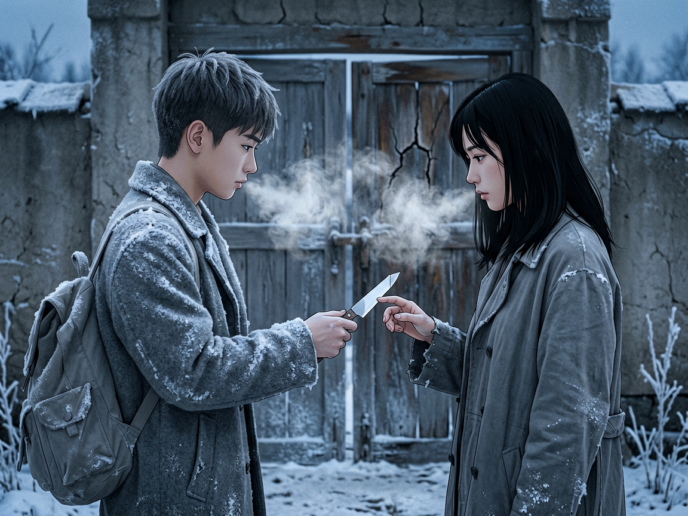
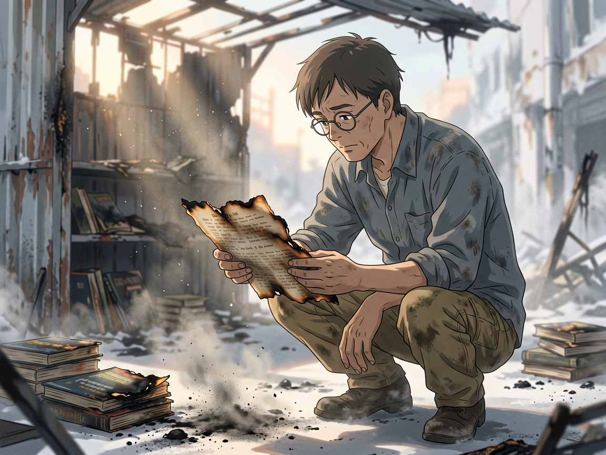
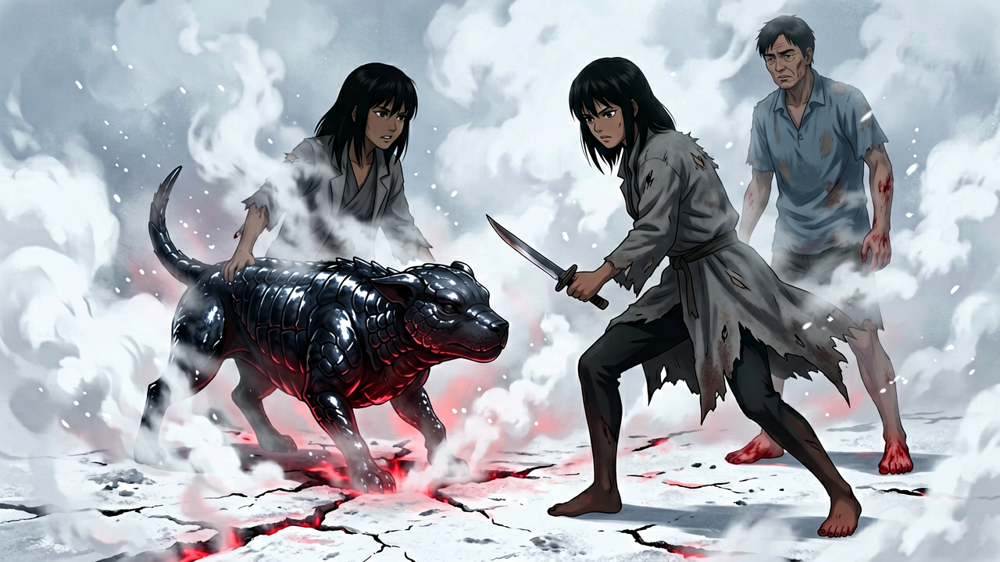

# 第十三章 出发——一路向南

天亮前，气温降到了零度以下。

她站在院子门口。呼出的气在面前凝成白雾，散了，又凝。背上的灰布包压着左肩——七本书。沈以南系的结比阿武紧一倍，布料嵌进她肩胛骨的缝隙里。她没调整。

他走出来时手里多了一样东西。

一个薄薄的、用灰布裹着的物件——小到可握在掌心里的裹法。他没有放进书箱。他把它塞进了外套内袋，左胸口的位置。

第八本。

这一本从一开始就不在那面矮书架上。

程序弹出一行：

> *观察记录：守书人首领·沈以南。携行真书×8。其中一本来源不明，未记录于据点藏书清单。分类：隐瞒行为。*

她没有标记。

沈以南走过她身边，停下来。

她开口：

"那本是什么。"

他停了一下。不长——足够她把那个停顿收进缓存里。

"回来再告诉你。"

程序弹出了"未获有效情报"标记。

她从门口走下来。背上的七本书在灰布里沉了一下。

---

<!-- 插图 · 出发之前（豆子递纸锋）

JSON结构化版
```json
{
  "tone": "离别前的沉默赠予。冷，克制，无声传递。天亮前的蓝调里，一个人把刀递出去，另一个人伸手接住。",
  "subject": "少年在黎明前的院门口递出纸锋，她指尖触到末端——冷的。",
  "moment": "她的指尖触到纸锋末端的那一瞬间。纸面的冷从指尖渗入指节。",
  "characters": [
    {
      "id": "豆子",
      "age": "约17岁",
      "face": "沉默，嘴唇紧闭，目光落在她手上而非脸上",
      "pose": "右手伸出，指间夹着纸锋，刀柄朝向她、刀尖朝向自己。左肩微沉，外套覆霜",
      "hair": "短发，发梢有凝结的水汽",
      "costume": "灰色外套，肩头和袖口覆着薄霜，领口残留夜间凝结的水汽"
    },
    {
      "id": "颜书瑶",
      "age": "约22岁",
      "face": "浅灰色瞳孔，无表情，目光落在纸锋上",
      "pose": "右手伸出，指尖刚触到纸锋末端。左手垂在身侧，背上有灰布包",
      "hair": "黑直发及腰，发尾在冷空气中凝滞",
      "costume": "灰布外套，灰布包压在左肩——七本书的重量嵌进肩胛骨"
    }
  ],
  "environment": {
    "场景": "据点院门口，破旧砖墙，木门半开",
    "细节": ["地面覆霜，鞋印清晰", "门框木纹开裂", "院墙上有昨夜霜花的痕迹"]
  },
  "lighting": {
    "光源": "天亮前的天光，无直射光源",
    "色温": "冷蓝偏灰，黎明前最暗的时刻",
    "特征": "环境光均匀偏冷，人物轮廓有极淡的天光勾边"
  },
  "dynamics": "呼出的白雾在两人之间凝成团，缓慢散开。纸锋表面有微弱的霜光。",
  "composition": {
    "镜头": "中景，两人侧面，纸锋在画面中央偏右",
    "焦点": "两双手之间的纸锋——她的指尖与他的手指",
    "纵深": "前景：霜白的地面；中景：两人对峙；背景：半开的木门内是暗色院落"
  },
  "color": {
    "主色": "冷蓝灰白",
    "辅色": "灰布外套的灰，木门的旧褐色",
    "对比": "冷蓝环境光与纸锋边缘微弱的霜白反光",
    "倾向": "整体极冷，无暖色"
  },
  "style": {
    "风格": "新海诚动漫风·废土冷白",
    "特征": ["精细光影层次", "大气透视感", "冷调色温控制", "废墟有美感但不脏"]
  },
  "mood": ["克制", "沉默", "离别", "无声的信任"],
  "negative": ["写实照片感", "恐怖感", "脏乱废墟", "暖色调", "对话气泡", "文字框体"],
  "aspect_ratio": "4:3"
}
```

纯文本版
```
新海诚动漫风·废土冷白，黎明前的据点院门口。少年约17岁短发，灰色外套覆霜，右手伸出递出纸锋，刀柄朝向她。她约22岁黑直发及腰，灰布外套，背灰布包，右手伸出触到纸锋末端。两人之间的白雾在冷蓝空气中凝团。地面覆霜，门框木纹开裂。冷蓝灰白主调，无暖色。中景侧面构图，焦点在两双手之间的纸锋。精细光影，大气透视感，废墟有美感但不脏。
aspect ratio 4:3
```

English Prompt
```
Shojo anime style, post-apocalyptic cold white aesthetic. Dawn blue hour, rural compound gate. A teenage boy (~17, short hair, frost-covered grey coat) extends a paper blade between his fingers, handle toward her. A young woman (~22, waist-length black hair, grey cloth coat, grey bundle on left shoulder) reaches out, fingertips just touching the end of the paper blade. Breath visible as white mist between them. Frost on ground, cracked wooden doorframe behind. Cold blue-grey-white palette, no warm tones. Medium shot, profile view, focus on the hands and paper blade. Fine atmospheric lighting, Makoto Shinkai-inspired, post-apocalyptic beauty without grime.

--no realistic photo, horror, warm tones, dialogue bubbles, text boxes, grime
aspect ratio 4:3
```
-->



老刘从灶房出来，手里拎着个布袋。灰布，收口处用麻绳系着。他递给她。

"路上吃。"

她接过来。沉。

老刘的手在布袋上多停了一下——指节曲着，还有话没说出口。嘴张了一下。又合上了。

"外头不比院里......饼凉了架火上烘一烘。布袋别扔——回来还使。"

他转身走回灶房，拐杖敲在地面上，那串脚步声比平时密了一些。

豆子站在大门边。

他后半夜就在这里站着了。外套上有一层薄薄的霜，肩膀和袖口都被凌晨的气温浸透了，领口处还残留着夜里凝结的水汽。他没有在等人。他就站在那里。

他的右手垂在身侧。

指间夹着一片纸锋——用了很久的，边缘有微卷，纸色发暗。

他把它递过来。

手伸到半空中，停住了。让她自己决定。

她没有接。

她看他。

豆子没有说话。他的手指在纸锋上动了一下——转了一个角度。刀尖朝向他自己。刀柄对着她。

程序弹出一行：

> *行为记录：守书人·豆子。递交纸锋×1。非训练场景。意图：赠送。*

她没有看那行字。

她伸手。

指尖触到纸锋末端时，纸面是冷的——凌晨的气温浸透了它。她握住的时候，那道冷从指尖渗进指节。中指与无名指之间。和那天练习时一样的位置。

她收下了。

豆子把手收回去。插进口袋里。

他从头到尾没有说过一句话。

她把纸锋折了一下——沿着纸脉的自然走向——收进外套内袋。和那页从废墟里捡来的纸锋放在同一个位置。

程序没有记录。

她经过他身边时停了一步。没有回头看他。

阿蕊的房门还是关着的。

---

他们走出据点大门时，天刚亮透。

废墟里的影子从西往东倒。她的靴子踩在碎玻璃上，压出细密的破裂声。沈以南走在她前面半步。她不知道他要带她去哪儿。她没有问。

---

一个十字路口。

柏油路面已经开裂，杂草从裂缝中挤出来。路口的西北角有一个铁皮棚架——烧过的。框架还在，顶棚塌了。铁皮卷曲着垂下来，边缘有一层褐色的氧化层——纸灰和铁锈混在一起的颜色。

她的脚停了一下。

沈以南已经停了。

他站在那个烧过的书摊前面。

铁皮棚架下面是一个倒掉的货架。木板烧穿了，残留的边角还维持着搁板的样子——上面堆着半焦的书。有些烧成了灰烬，只留下一个形状。有些烧了一半，纸页边缘卷曲成黑色。

他蹲下来。

他的手伸向那堆烧焦的书——指尖从灰烬表面扫过去，灰扬起来，在晨光中散成一片暗色的雾。

她站在他身后两步的位置。没有走近。

程序弹出一行：

> *行为记录：守书人首领·沈以南。在废弃书摊处停留。检查烧毁书堆。耗时：未完成。*

他找到了一样东西。

在书堆的最下层——一页纸的边角。没有被完全烧掉。边缘是焦褐色的，卷曲着，中间部分还留着几行字。字迹是印刷体，油墨在火中化开了一部分，但还有几个字可读。

他把它拿起来。没有举到眼前——他把那一角纸托在掌心里，低头看。

他的脸没有表情。没有笑。没有皱眉。

他读了那几个字。

然后他把那页纸放回了原处——放在灰烬的最上层，为一个标记。

他站起来。继续走了。

没有回头。

她跟上去。没有问。

他蹲下去的时候——膝盖先碰到地面才弯下去。

---

她回头看了一眼那个书摊。灰烬的最上层，那张纸角在晨光中微微翘起——边缘的焦黑还在。

她转回去。跟上他。

---

<!-- 插图 · 烧毁的书摊

JSON结构化版
```json
{
  "tone": "对已逝之物的最后致意。平静，哀而不伤。一个人蹲在灰烬前读几个残字，放回去，站起来走了。",
  "subject": "中年文人蹲在烧毁的书摊灰烬前，指尖扫过焦纸表面，掌心托着一角残页。",
  "moment": "他把那一角焦纸托在掌心低头读完，放回灰烬最上层的那一刻。没有表情。然后站起来。",
  "characters": [
    {
      "id": "沈以南",
      "age": "约35岁",
      "face": "无表情。没有笑，没有皱眉。旧金属框圆形眼镜，目光落在掌心的焦纸上",
      "pose": "蹲姿，膝盖先碰地面才弯下去。左手撑膝，右手托着一角焦纸——纸页边缘焦褐卷曲，中间残留几行印刷体",
      "hair": "短发，额前有几根被风吹乱",
      "costume": "褪色灰蓝棉质衬衫，旧帆布裤，脚边放着书箱"
    }
  ],
  "environment": {
    "场景": "十字路口西北角，烧毁的铁皮书摊",
    "细节": ["铁皮棚架顶棚塌陷，边缘褐色氧化层", "木板货架烧穿，残留搁板形状", "半焦的书堆，纸页边缘卷曲成黑色", "灰烬层叠，底层灰白、表层焦黑"]
  },
  "lighting": {
    "光源": "晨光从东侧低角度射入",
    "色温": "冷白偏暖——晨光带来的微弱暖色与灰烬的冷灰形成对比",
    "特征": "晨光穿过塌陷的铁皮棚架，在灰烬表面拉出斜长的影子。灰尘在光柱中浮动。"
  },
  "dynamics": "指尖扫过灰烬表面时，灰扬起来，在晨光中散成一片暗色的雾。焦纸边缘有微弱的卷曲颤动。",
  "composition": {
    "镜头": "中近景，俯角约30度，从她身后两步的位置望去",
    "焦点": "他掌心中的那一角焦纸——边缘焦褐，中间几行残字",
    "纵深": "前景：书箱和她的靴尖；中景：他蹲在灰烬前的侧影；背景：塌陷的铁皮棚架和远处的十字路口"
  },
  "color": {
    "主色": "灰烬的冷灰白",
    "辅色": "焦纸的褐色，铁皮的锈红",
    "对比": "冷灰环境与晨光的微暖，焦黑边缘与残留纸页的米白",
    "倾向": "整体偏冷，晨光带来一丝极弱的暖"
  },
  "style": {
    "风格": "新海诚动漫风·废土冷白",
    "特征": ["精细光影层次", "灰尘粒子在晨光中浮动", "废墟有美感但不脏", "文人气质的静穆感"]
  },
  "mood": ["平静", "哀而不伤", "告别", "沉默的仪式"],
  "negative": ["写实照片感", "恐怖感", "脏乱", "情绪化的表情", "对话气泡", "文字框体"],
  "aspect_ratio": "4:3"
}
```

纯文本版
```
新海诚动漫风·废土冷白，十字路口的烧毁书摊。约35岁文人蹲在灰烬前，旧金属框圆形眼镜，褪色灰蓝棉质衬衫。左手撑膝，右手掌心托着一角焦纸——边缘焦褐卷曲，中间残留几行印刷体。灰烬在晨光中扬起，散成暗色的雾。铁皮棚架塌陷，木板货架烧穿。冷灰白主调，晨光微暖。俯角中近景，焦点在掌心的焦纸。灰尘粒子在光柱中浮动。废墟有美感但不脏。
aspect ratio 4:3
```

English Prompt
```
Shojo anime style, post-apocalyptic cold white aesthetic. Morning light at a crossroad. A middle-aged man (~35, round wire-frame glasses, faded grey-blue cotton shirt, old canvas pants) crouches before a burned bookstall. His right hand holds a corner of charred paper in his palm, edges brown-black and curled, a few lines of printed text still legible. Left hand rests on his knee. Ash rises from the surface, scattering as dark mist in the slanted morning light. Collapsed tin shelter frame overhead, half-burned books stacked nearby. Cold grey-white palette, faint warm morning light. 30-degree overhead angle, two steps behind him as viewpoint. Focus on the charred paper corner in his palm. Dust particles floating in light shafts. Post-apocalyptic beauty without grime, Shinkai-inspired atmospheric lighting.

--no realistic photo, horror, grime, emotional expressions, dialogue bubbles, text boxes
aspect ratio 4:3
```
-->



---

正午。走到一处高架桥残骸下。他停下来。她从背包侧袋里掏出干饼。两个人分了一块。他咬了一口，嚼了很久。她看到他的小腿在微微发颤。

她看到了。没有说。

"过了高架桥——再走半日，该到加油站了。那边有墙，能歇。"

他把最后一口饼咽下去。站起来。继续走。

地面的植被在变。杂草越来越矮，最后只剩下贴着地皮的灰色苔藓。土壤的颜色从灰褐变成浅黄，再变成一种干燥的、泛白的沙土色。她的靴子踩上去，扬起的尘土比之前多了。

黄昏时分，她先闻到了铁锈和油污的气味。

她看到他放慢了步速。

---

一座废弃的加油站。

顶棚的铁皮还在。加油机的骨架歪了，油枪从机身上垂下来，注油口残留着干透的油渍。便利店的玻璃门碎了——碎玻璃在地面上铺了一层，边缘在傍晚的光里泛着细碎的光。门框上挂着一块褪色的广告牌，字迹被风蚀尽了，只剩一块铁皮在风里轻轻抖。风从破碎的窗洞灌进去，在空房间里旋了一圈，带出一股气味——陈年的灰，干掉的机油，铁锈。

空气是冷的。呼出的气在面前凝成一团，散得很慢。

他站在加油站的棚架下，卸下肩上的书箱。动作不快。

她开始生火。

程序弹出一行标准野外操作指南——可燃物优先顺序、风向切角、防火隔离半径。她没有看。她从废墟里捡了几块碎木——加油站后墙有被风刮来的枯枝，已经干了很久，一折就断。她把枯枝架起来，碎木围了一圈。火柴从布袋里摸出来。第一根划下去——磷头擦过砂面，火星溅到枯枝上，灭了。第二根。火苗在枯枝底部舔了一下，卷起来。

枯枝开始爆裂。细小的炸裂声，干燥的，短促。

她把多余的燃料码在手边。

他坐在火对面。膝盖并拢，双手放在膝盖上。火光照在他脸上——金属框的眼镜片上烧出两团缩小的光。他没有看她。他看火。

她从便利店残骸里找到半张铁皮——边缘有锈，沾着隔夜的霜。她把铁皮靠在风口处。风撞在铁皮上，折了一个方向，从火堆上方绕过去。火稳定了。

程序问她是否记录露营坐标。她没有回答。

夜风从破碎的窗洞里灌进来，经过火焰时，光晃了一下。影子和她身上的光线一起变了。

她坐在火和门之间。他在火的那一侧。

---

后半夜。

风把火吹小了一些。她没有添柴。余烬还在——暗红色的炭埋在灰下面，偶尔爆一粒火星。足够照明，不会在夜色里暴露太远。程序没有提示。

他醒了。

没有起身。没有说话。他的右手在外套内袋上按了一下——指尖沿着灰布裹着的轮廓摸过去，找到书脊的位置，停住。他没有掏出来。他隔着布料按住它。手指并拢，掌心贴着那层布。火光照在他手上——指节曲着，指甲边缘有干裂的口子。

然后他闭上了眼睛。

眼睑合拢之后没有再动。面部其他部分的肌肉没有放松。他在听。

她在余烬的另一侧。隔着一段距离和一排暗红色的炭火。她没有移开目光。程序没有生成行为分析。它没有为这个动作生成任何标签。

她不知道他听到了什么。

她听到的是风穿过断裂的窗框。碎玻璃在地面上偶尔响一声——风把它推了一下，玻璃边缘在水泥地上刮了一下，又停了。

然后远处有声音。

不是风。

那个声音从东南方向来——第一声短促，干燥。停顿。第二声比第一声低了一些，拖长了尾音。然后第三声从另一个方向应了。

野狗。至少三只。

她没有转头。她的视线没有从那个方向上移开。

第二声之后，声音近了一些。她听到了爪子踩在碎玻璃上的声音——隔着一片空地，大约两百步。那个声音停了一下，然后向左边移动了。

它们在绕。

她没有告诉他。

她站起来。动作很轻——重心先移到左脚，然后起身，没有压到地面上的枯枝。她坐到了靠门的方向——背对着出口。视线覆盖了野狗叫声传来的方向。

他没有动。手还在胸前按着那本书。他没有问。

黑暗里，他的声音响起来——不大，像在自言自语：

"这本——不是据点清单上的。从前有一位守书人走过这条路。回来以后写的。写了半本，没写完。后来他走了，就没再回来。我收着它，八年了。没告诉过任何人。"

野狗在远处又叫了一声。他没有停。

"不是什么要紧的东西。只是想——该让你知道。"

她没有回答。

她坐在黑暗里。手指在口袋中触到了纸锋的边缘——冷的。她没有掏出来。她用指腹贴着那道边缘。

余烬在空气中一段一段地变暗。风从铁皮的边缘灌进来，从她的领口、袖口渗进去，贴着皮肤往下走。她没有调整姿势。她的视线固定在东南方向。那里偶尔有碎玻璃被碰响的声音——一声，停了。过一会儿，又一声。没有靠近。也没有远去。

天快亮时，野狗的声音远了。最后一声从北边传来——它们已经过了公路，往更远处走了。

她没有睡。

---

天亮后，风停了。

地面变了。柏油碎块和沙土消失了——只剩一层灰白色的、龟裂的硬壳。她的脚踩上去，没有实心的回音。下面是空的。蒸汽从裂缝中渗出，带着硫磺的气味。

地热区。

程序弹出一块地质风险评估面板——她扫了一眼：地表温度从东向西梯度上升，裂缝处最高可达烫伤阈值。地壳稳定性在边缘区尚可，中心区不可预测。

她把面板关掉了。

她回头看沈以南。

他站在地热区边缘。左脚悬着——鞋底在试探地面温度。鞋底太薄了。

他把鞋脱了。拎在手里。

她把书箱从肩上卸下来。

> *建议：绕行路线待确认。当前装备不适用高温地形。*

"踩着我的脚印走。"

她转身，走进地热区。

每一脚先踩实。脚跟先落地，压下去——确认地面能吃住体重。重心前移。再迈下一步。程序在视野左下角挂着数据：地表温度、承重系数、裂缝宽度。她用它在确认下一步能不能放脚。

走出大约二十步。回头看。

沈以南赤着脚站在她第一排脚印前。他踩进去了。

她转回去。继续走。

每一步更用力一些——把脚印压深，让他更容易辨认。硫磺气味越来越重。热浪从裂缝中升起，空气在她面前扭曲成透明的波纹。

额角的汗滴落在地上——蒸发了。

> *热应力警告：建议缩短每次地面接触时长以降低鞋底材料损耗率。*

她在看到警告的同时调整了步频。额头的汗开始流进眼睛里。她没有擦。

---

她在一道裂缝前停下来。

跨不过去。裂缝太宽——大约一臂。边缘不整齐，从下方撕裂开的。深处有暗红色的光，很淡。

热气从缝隙中涌出来。她的脸在那一瞬间被蒸得发烫。她侧过头。绕。

她找了一处较窄的位置——半臂宽。先迈过去。落地时地面晃动了一下。她蹲下来，手掌按在地面上，等。

地面稳住了。她站起来。

"这边。"

她站在裂缝对岸。他的赤足踩在她留下的脚印里——脚底皮肤泛红。他的脚趾在落地时本能地蜷了一下。

她没有说。她继续走。

---

就在这时——

一个声音。从左侧一个比人高的蒸汽喷口——石壁后面传出来的。某种东西在石面上刮过。短促。干燥。

她停下了。

程序没有弹窗。

她站在原地。没有转身。她用侧面的视野锁定了那个蒸汽出口的位置——大约七步。蒸汽从喷口涌出，一团白色，遮挡了视线。

蒸汽散了。

喷口内侧——石壁的阴影里——有什么东西动了。贴着石壁爬出来的。肢节从蒸汽的缝隙中伸出来，着地时没有声音。

程序弹出一行：

> *未知生物体·热区型。热成像：无法锁定。*

她盯着那行字读完。

那个东西完全从蒸汽中出来时，她看到了全貌。

四足。大如猎犬。暗色甲壳覆盖全身，在热雾中泛着一层油光。它的身体低伏，肢节构造适合攀附岩石。没有眼部结构——面部是一块平整的甲板。它在用热感应定位。它的头转向了她。

---

它动了。

朝她身后去的。它在蒸汽喷口之间穿行，每一次喷气时移动一次，用蒸汽掩护位移。它的路径在捕捉她身后的目标。

她向左跨了一步。侧身。插进它和沈以南之间的连线。

右手伸进外套内袋——纸锋。抽出来。

那个东西从蒸汽中扑出。她侧翻滚——向前，从它下方滚过去。纸锋在她右手指间翻了一个面。她没有在滚动中出刀——她在等一个角度。

那个东西落地后转向。关节着地无声。它的第二次扑击在第一次落地的同时启动。

她右手撑地，身体侧转——左腿扫出去。没扫到。那个东西在空中调整了姿态，从她上方越过。她看到了它的腹部——甲壳由板片交叠而成，之间有缝隙。

她没够到那个角度。

她站起来。纸锋在指间。

那个东西在七步外。蒸汽从它右侧的裂缝中喷出，它没有动。

---

第三次。

它用后肢发力时，前肢先压低了。那个压低给了她半秒。

她向右闪时留了半个身位。那个东西的爪击擦着她的左侧扫过，爪尖刮过她的外套。布面撕裂的声音。她在那半个身位里侧身，右手递出。

纸锋切进它的前肢关节处。

切进去了——刀锋穿过甲壳时有一个阻滞，然后滑进去了。那个东西的肢节在刀锋下猛地抽紧。

它叫了。

金属撕裂的声音——从它胸腔里挤压出来的。它后撤。前肢着地时那只受伤的腿在抖。

它没有退远。它绕着她走了半个圆弧——用蒸汽喷口做掩护。蒸汽从它身边涌过，它的轮廓在白色中断续闪现。它在重新算。

她站在原地。纸锋上的液体往下滴——暗色，比血稠。滴在地面上蒸发，留下一道深色印迹。

沈以南在她身后。她没看他。

---

第四次扑击——它在蒸汽喷出的同时启动。用蒸汽掩盖加速度。

她没来得及完全避开。

它的体重撞在她右侧——她侧身卸了一部分力，冲击还是把她推了出去。后背撞在石壁上。热气从石壁裂缝中涌出——烫。她的左肩感觉到了那层烫。

那个东西的头压下来——咬合。

她左手撑住它的下颚。甲壳表面是热的。光滑。她的手指在上面打滑。右手翻腕——纸锋从下往上刺进去。刺进颈部和胸甲之间的那片缝隙。

刀锋没入过半。

那个东西的身体在她上方僵了一瞬。然后它退开了。猛地。纸锋从她手中脱出——插在它身上，没有拔出来。

它退进蒸汽里。蒸汽喷出时，她看到它侧面的轮廓——纸锋还插在它的颈侧。它的脚步不稳了。

它消失了。

蒸汽从喷口中继续喷出。地面上有暗色的液体。蒸发的痕迹。

她靠在石壁上。右手指间是空的——纸锋在那个东西身上。

她从外套内袋里抽出另一片纸锋——从废墟里捡来的那一片。展开。夹在指间。

程序弹出一行：

> *建议：目标已受伤。追击可能性：高。*

她看完了那行字。

她把纸锋折了一下。收回内袋。

她没有追击。

---

她转头。

沈以南站在几步外。他手里拿着一块石头——不知道什么时候捡的。他握着它，指节发白。他没有扔出去。但他握着它。

她看了那石头一眼。

那个东西没有靠近过他。

她把视线移开。蹲下来检查自己的右侧——外套撕裂了，布料翻开。没有伤口。外套被撕开了，她没受伤。

她站起来。

"走。"

"你没受伤？"

她没有回答。她转身。她的脚印还在龟裂的地壳上——鞋印清晰。她踩回原有的足迹上。

身后的脚步声在两次呼吸之后重新响起来。

日影在偏。地面上的裂缝渐渐变少。空气中硫磺的气味开始变淡。

她走出地热区时，太阳已经偏西。

最后一步踏在实心的土地上——脚下的触感变了。硬实的。常温的。她站在那里。

回头看。

沈以南在二十步外。

他赤着脚，踩在她最后几排脚印上——那些脚印的纹路在他脚下模糊了，边缘被热风吹散了。但他跟着它们走过来了。

他走出地热区的时候，脚步没有停——他站不住的时候身体已经停了下来。他把鞋子放在地上，没有立刻穿。脚底泛着一层不均匀的红。他低头看着自己的脚。没有碰。

然后他抬头，看她。

他看了她一眼。她在。她在看他。

他张了张嘴。没出声。

她嘴唇动了动。

"走吧。"

她转身。继续走。

她走了一整天——每一步，后面都有一双脚落在她的脚印上。

---

<!-- 插图 · 地热区·掠食者

JSON结构化版
```json
{
  "tone": "蒸汽中的对峙。紧张，保护。她侧身挡在他前面，甲壳生物从白雾中显现。热浪扭曲空气，纸锋在指间。",
  "subject": "她侧身挡在文人前面，纸锋夹在指间。蒸汽喷口旁，四足暗色甲壳生物从白雾中显现轮廓。",
  "moment": "蒸汽散开的瞬间——甲壳生物的全貌从白雾中剥离出来，她的纸锋已经抽出，身体挡在两者之间的连线上。",
  "characters": [
    {
      "id": "颜书瑶",
      "age": "约22岁",
      "face": "浅灰色瞳孔锁定蒸汽出口，无恐惧，冷白皮肤被热气蒸得泛红",
      "pose": "侧身，左脚前右脚后，重心压低。右手伸出外套内袋，纸锋夹在中指与无名指之间。左手微张保持平衡",
      "hair": "黑直发及腰，发尾被热风吹起",
      "costume": "灰布外套，外套撕裂处布料翻开，灰布包仍在背上"
    },
    {
      "id": "沈以南",
      "age": "约35岁",
      "face": "被蒸汽和她的身影遮挡，只露出半个侧脸，旧金属框眼镜反光",
      "pose": "站在她身后，赤脚，脚底泛红。身体微微后倾",
      "hair": "短发，额前被汗浸湿",
      "costume": "褪色灰蓝棉质衬衫，旧帆布裤，赤脚无鞋"
    }
  ],
  "environment": {
    "场景": "地热区，龟裂的灰白色硬壳地面，蒸汽喷口从石壁中伸出",
    "细节": ["地面裂缝中有暗红色微光", "蒸汽从多个喷口涌出", "空气因热浪扭曲成透明波纹", "石壁粗糙，有硫磺沉积的黄色痕迹"]
  },
  "lighting": {
    "光源": "无直射日光，蒸汽散射环境光。裂缝中的暗红色地热光从下方透出",
    "色温": "冷白蒸汽与暗红地热光的对比",
    "特征": "蒸汽在逆光中呈半透明的乳白色，人物轮廓被蒸汽柔化。甲壳生物的油光在热雾中闪烁。"
  },
  "dynamics": "蒸汽从喷口涌出，在两者之间翻滚。甲壳生物的肢节无声着地。热浪扭曲空气。纸锋边缘有微弱反光。",
  "composition": {
    "镜头": "中景，低角度仰拍，从她右侧偏后方望去",
    "焦点": "她侧身的剪影与蒸汽中甲壳生物的轮廓之间的对峙线",
    "纵深": "前景：龟裂地面的裂缝红光；中景：她侧身挡在中间，纸锋在指间；背景：蒸汽中甲壳生物的四足轮廓与沈以南被遮挡的身影"
  },
  "color": {
    "主色": "蒸汽的乳白与地面的灰白",
    "辅色": "甲壳生物的暗色油光，裂缝的暗红",
    "对比": "冷白蒸汽与暗红地热光，人物剪影的深色与蒸汽的亮白",
    "倾向": "冷白为主，暗红为危险信号"
  },
  "style": {
    "风格": "新海诚动漫风·废土冷白",
    "特征": ["蒸汽粒子效果", "热浪空气扭曲", "甲壳生物的油光质感", "紧张的对峙构图"]
  },
  "mood": ["紧张", "保护", "对峙", "蒸汽中的危险"],
  "negative": ["写实照片感", "血腥", "恐怖感", "脏乱", "对话气泡", "文字框体"],
  "aspect_ratio": "16:9"
}
```

纯文本版
```
新海诚动漫风·废土冷白，地热区蒸汽喷口旁。她约22岁黑直发及腰，灰布外套撕裂，侧身挡在前方，右手纸锋夹在指间，重心压低。他约35岁赤脚站在她身后，褪色灰蓝衬衫，半个侧脸被蒸汽遮挡。四足暗色甲壳生物从蒸汽中显现——大如猎犬，全身油光甲壳，无眼部结构，面部是平整甲板。龟裂地面裂缝透暗红光。乳白蒸汽在两者之间翻滚，热浪扭曲空气。冷白蒸汽与暗红地热光对比。低角度中景，焦点在她剪影与甲壳轮廓的对峙线。蒸汽粒子效果，甲壳油光质感。紧张，保护，对峙。
aspect ratio 16:9
```

English Prompt
```
Shojo anime style, post-apocalyptic cold white aesthetic. Geothermal zone, steam vents. A young woman (~22, waist-length black hair, torn grey cloth coat) stands sideways in protective stance, paper blade between fingers of her right hand, knees bent, weight low. Behind her, a middle-aged man (~35, barefoot with reddened feet, faded grey-blue shirt) is partially obscured by steam. From the steam vent, a four-legged dark chitinous creature emerges — dog-sized, glossy shell plates covering its body, no eyes, flat facial plate. Cracked white ground with faint red glow from fissures below. Billowing white steam between them, heat distorting the air. Cold white steam contrasting with deep red geothermal light. Low-angle medium shot, focus on the confrontation line between her silhouette and the creature's outline in the mist. Steam particle effects, chitinous shell sheen. Tense, protective, standoff.

--no realistic photo, blood, horror, grime, dialogue bubbles, text boxes
aspect ratio 16:9
```
-->



---
天黑前，他们在地热区边缘的一道干河床边扎营。

地面还有余温。趴下去能感觉到热气从土里渗出来，贴着胸口和腹部，缓慢的，带着地面之下涌动的温度。冷和热在皮肤上交汇的地方，有一层薄薄的、发潮的暖意。她把外套铺在地上。他坐上去，没有躺下。腿悬在河床的沙土上——脚底还泛着红，在黄昏的光里颜色更深了一些。

她没有叫他处理伤口。她在他脚边的地面上放了一壶水。

他看了那壶水一会儿。然后拿起来。用布蘸了水，敷在脚底。

她坐在火对面。偏了一点角度——火在她和河岸线之间烧着，火焰不会挡住她的视野。视线覆盖了整条干河床：左右两侧的河岸线，河床尽头转弯处那块巨石，干涸的沙土上自己和他投下的影子。远处有夜鸟叫了一声。然后安静了。

没有第二声。

火在河床里烧着。两边是土壁。火光被收在河床的槽里，从远处看，大概只是一团暗红色的晕。她的视线停在那块转弯处的巨石上。风从河床边缘扫过，带起一层细沙，在低处打着旋。没有东西从石头后面出来。

他开口：

"南境有多远。"

她在确认自己知道的事。回答了：

"三天。"

程序在左下角弹出一个地理信息确认框。她关掉了。

他沉默了。火在沉默里爆了一粒火星——枯枝里残留的一点树脂，烧出来的声音很短，在河床的土壁之间弹了一下就没了。然后又是火的声音：细小的，持续的，干燥的爆裂声。

她开口：

"你走过几次。"

他抬头。火光在他脸上晃了一下——镜片上有两团缩小的火，在他瞳孔的位置跳了一瞬。

"一次。"

火跳了一下。风从河床的转弯处灌进来，火焰被压低了，又弹起来。

"来的时候。没到。"

火在河床里烧着。他没有立刻续下去。

"走到一半，火从地下烧上来了。不是地热——天然气管道破了。整片地面都在烧。我绕了三天，绕不过去。折返的时候——水喝完了。以为回不来了。"

她听完了。程序没有弹窗。

她从外套内袋里抽出那片纸锋——豆子给她的那片。夹在指间。火光照在纸锋表面——纸面不平整，有细微的褶皱，在火光里拉出一道极细的亮线。那道线沿着纸锋的边缘走，从刀尖到末端，极细，在火光中亮了一瞬。她的手指在刀锋两侧停了一下。

她把纸锋收回去。夹层的布料接住它，合拢。

火小了。她没有加柴。余烬在风里明灭了几次，慢慢暗下去。

---

天亮前她醒了一次。

身体知道该醒了——她在设定的时间睁开眼。天空还是暗的，但最东边的颜色已经开始变了，从墨蓝往灰白转。

他还没醒。面朝上躺着，一只手搭在胸前——按着内袋的位置。那本书还在。他的呼吸很浅，胸口的起伏几乎看不出来。火堆只剩灰白色的灰烬，最底层还有一点暗红。没有烟。

脚掌上的红已经褪了。脚底起了几道浅色的水泡——透明的，在晨光里泛着一层极薄的亮。他没有动。他睡着的时候，脸上的线条和醒着时不一样。眉间有印痕——醒着的时候也有的，只是醒着的时候他总是抬着头，现在垂下来了。

她在黑暗里看了他一会儿。程序没有计算这个时长。

她站起来。从河边捡来的枯枝还堆在手边——最底层的几根沾了夜里的潮气。她把它们架在余烬上，俯身吹了一口气。灰白色的灰烬下面，暗红色的炭亮了一下。枯枝开始冒烟，然后火苗从底部钻出来。

火重新生起来的时候，他还没醒。她坐在火边。

---

第三天。他们走到一处河谷。

地面从砂土变成碎石，再变成被水流冲刷过的圆石。草又出现了——她踩过的地方，草叶弹回来，在脚踝处扫过，带着清晨的水汽。

他走在她身后。鞋穿上了，但走路的姿势变了。每一步落地的时候，他的重心偏在脚掌外侧。他在用脚底没起水泡的位置走路。她没有放慢。

他没有掉队。

风从河谷方向来。她闻到了水的气味——静止的、带着淤泥和腐殖质味道的水。干涸河床尽头，是一个断崖。

她站到边缘。

下面是一座宽阔的河谷。河床是干的——曾经的水道只剩下裸露的沙石，在正午的光照下白得刺眼。河面上方的桥，断了。

桥墩还在。桥面的金属结构被拆走了——切口整齐，有人用工具一片一片拆下来卖掉的。桥面从中间塌陷，剩下两端的钢筋混凝土骨架，中间悬着一段空的、被风贯穿的缺口。

河床下面有人。

她看到了——河床的低洼处，有几间用废料搭起来的棚屋。铁皮、木板、塑料布拼凑在一起。烟囱里冒出一缕灰烟——烧东西的烟。纸灰的气味混在风里。

沈以南走到她身侧。他往下看。

"要从这里过了。"

"下面那些人——收纸的。旧书、废纸、带字的，什么都收。过他们的地界，要用东西换。用书。"

她看着他。他没有补充。

她低头看向河床里的棚屋区。烟囱里那缕灰烟还在上升，在风中被扯散。纸灰的微粒在阳光下飘了一会儿，然后看不见了。

空气中残留着烧过的纸的气味。

她从断崖上收回视线。

程序弹出一行空白——没有评估，没有分类。它在等她提供标签。

她没有给。

她开始找下河谷的路。

（第十三章 完）
