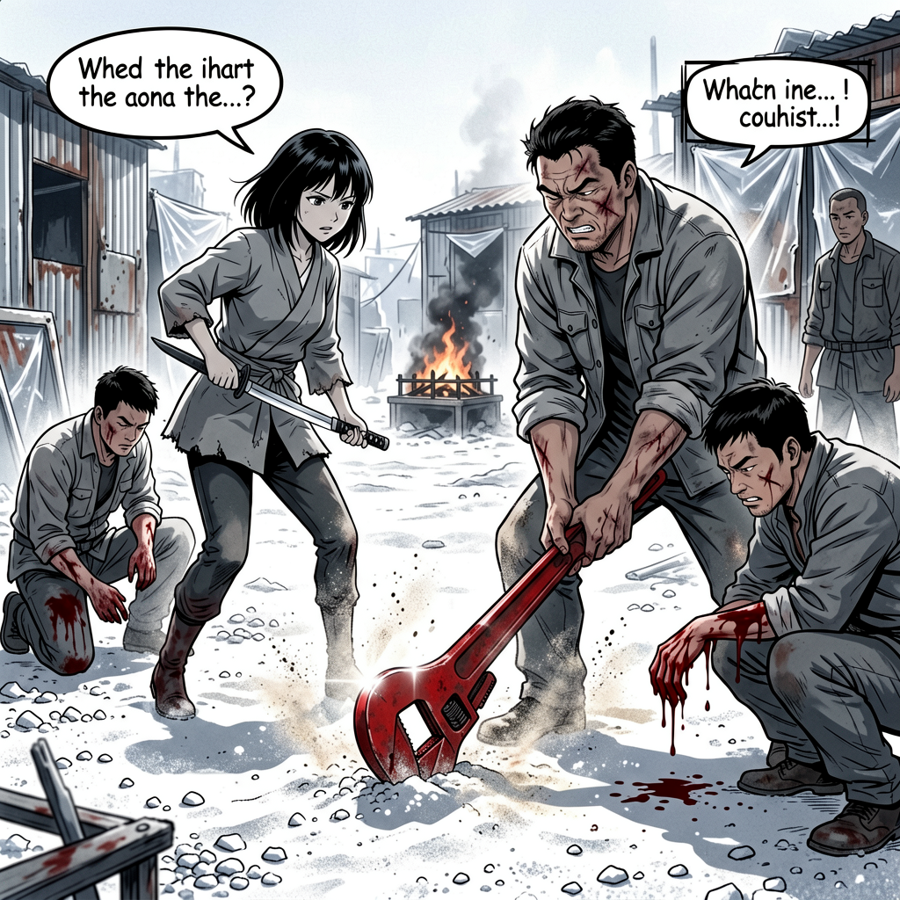
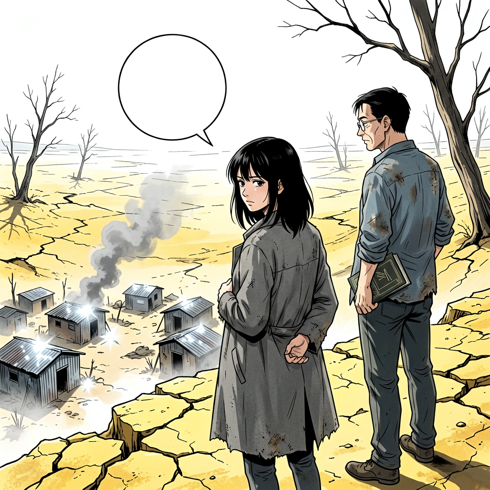

# 第十四章 断桥——买路钱

崖壁上有凹槽。

不是天然的。有人凿出来的，间距大约半臂，从崖顶一路延伸到河床底部。凹槽边缘的石头被磨光了，留下手掌和脚掌反复踩踏的痕迹。凹槽的深度不一，最深的有两寸，最浅的只有一指宽。石头的表面粗糙，但被磨过的地方光滑，反光。

她先下。

手指扣进最上面的凹槽，指腹贴上去的时候能感觉到石头的温度。烫。正午的光把石壁晒透了，热量从石头里往外渗，烫手心。她没有停。脚尖踩住第二格。靴底踩在石头上，硬的，没有弹性。她往下看。崖壁笔直往下，河床在四十米下面，白沙石反着白光。风从谷底往上吹，从她的脚踝往上走，干燥的，热的，带着沙土的气味。

一步一步往下。凹槽之间的距离不均匀。有一处隔了将近一米，她伸手够不到下一个，脚在石壁上蹭了一下，靴底刮掉一层碎石，碎石落下去，在崖壁之间弹了两下才消。碎石落在河床上的声音很远，隔了几秒才传上来。她等那个声音消了，才继续往下。手指扣进下一个凹槽。指关节发白。

程序弹出一块面板。

> *地形扫描中。崖壁高度：42米。坡度：87°。凹槽数量：23。风速：2.3m/s，方向：自谷底向上。建议：匀速下行，避免重心偏移。*

她读完了。面板没有关掉。她继续往下。

沈以南在上面等她落稳了才开始下。他的动作比她慢。手扣进凹槽时指节曲着，脚踩下去的时候身体往石壁上贴了一下。他没有往下看。书箱从他的右肩换到左肩，绳子勒进衬衫的布料。他下到第三格的时候停了一下，调整呼吸。然后继续。他的手指在凹槽里扣得很紧，指甲边缘泛白。

她先落到河床。脚踩在沙石上。干的。沙石白得刺眼，正午的光从天顶照下来，打在河床上反射上去，她眯了一下眼。靴底陷进沙里半寸。沙石的温度比石壁低一些，但还是热的。空气干燥，吸进去的时候喉咙发紧。河床很宽，往左右两边延伸，消失在崖壁的转弯处。远处有风卷起沙土，在河床上空形成一层薄雾，阳光穿过沙雾的时候变成浑浊的白色。

程序更新了。

> *海拔：-42m。气温：38°C。湿度：12%。地形：河床，白沙石，宽度约60米。风速：3.1m/s。*

她读完了。抬头看河床前方。棚屋区在河床的低洼处，大约八百米外。

沈以南落下来的时候喘了一口气。很短。他把书箱从肩上卸下来，放在地上。书箱底部沾了一层白灰。他站在原地，调整了几下呼吸。衬衫的后背湿了一块，颜色比其他地方深。他用手背擦了一下额头。手背上沾了白灰。

她把书箱重新背上。朝棚屋区走。沈以南跟在后面。河床上没有路，但白沙石上有人走过的痕迹，脚印被风抹平了一半，剩下模糊的凹陷。

---

棚屋区沿河床的低洼处排开。

十几间棚子。铁皮、木板、塑料布，用铁丝和绳子绑在一起。有的棚子只有一面墙，另外三面用塑料布围起来，风一吹，塑料布鼓起来又瘪下去，发出闷响。铁皮顶上有锈迹，从钉子的位置往四周蔓延，深浅不一。塑料布的颜色不一样，有蓝的，有白的，有那种半透明的，被太阳晒得发黄。绳子从一个棚子拉到另一个棚子，上面挂着东西。几件衣服，灰的，看不清原来什么颜色。一条毛巾，硬了，被风吹得晃。一串塑料袋，装着什么东西，鼓鼓的，被风吹得撞在一起，发出沙沙的声音。

人不多。七八个人。动作都慢。手插在口袋里。有人蹲在棚子门口，手指在沙地上划着什么，划了几下停了，又从头划。有人靠着铁皮墙坐着，眼睛半闭着，嘴里嚼着什么东西，腮帮子一动一动。有人站在两个棚子之间的缝隙里，背对着他们，肩膀微微耸着。没有人抬头。

河床中央有一个火坑。

不大。直径大约两米，边缘用石头围了一圈。石头被熏黑了，靠近火的那一面颜色最深，往外渐浅。坑里烧着枯枝和碎木。火不大，但稳。火焰是橘红色的，根部有一圈蓝色。偶尔一阵风过去，火焰歪了一下，烟从火里窜出来，灰白色的，往上走，在半空中散成一片。火坑旁边堆着一些东西，旧纸、碎木、几块铁片。纸没有往火里扔。纸堆在坑边，边缘卷曲，被烟熏得发黄。枯枝和碎木是主要的燃料。灰烬在坑底堆了厚厚一层，灰白色的，被风吹得表面起了一层细纹。

程序弹出一块面板。

> *环境扫描完成。棚屋区×1。居民：7-9人。物资类型：废金属、枯枝、旧纸。火源：明火，温度约400°C。铁皮棚屋结构稳定性：低。塑料布覆盖率：约60%。绳索连接点：23处。危险评估进行中……*

她读完了。面板没有关掉。它留在视野的右下角。面板旁边又弹出一块小的，是热成像。棚屋里有热源，不止人。还有火坑。还有几个小的热源，分布在棚屋周围，可能是动物。

底部浮出一行字：

> *威胁等级：低。建议：保持警惕。*

她信了前半句。后半句她本来就在做。

---

他们走到棚屋区边缘时，一个人从最近的棚子里出来。

中年男人。宽肩膀。灰色外套，袖口卷到小臂。小臂上有几道旧疤，颜色比周围的皮肤深。右手拎着一把管钳，钳口朝下，自然垂着。管钳的铁锈从钳口往上蔓延，到了手柄的位置变成深褐色。他站在棚子门口。看了他们一眼。又看了一眼书箱。他的视线在书箱上停了三秒。

"过路费。"

他的声音不高。不低。说这两个字的时候嘴唇没怎么动，下颌只是微微开合了一下，气息平的，像在报一个数。

"一本书。旧的，有人看过的。新的不要。"

沈以南把书箱从肩上放下来。蹲下。打开箱盖。箱盖翻开的时候，里面的书露出来。七本。有的书脊朝上，有的侧面朝上。他没有马上拿。他看着那七本书。手指从第一本的书脊上划过去，停了一下。又划到第二本。第三本。他的手指在第三本书的书脊上停了久一些。

她站在他身后两步。她的视线从那个男人身上扫过，再扫向他身后的棚子。塑料布后面有影子在动。不止一个。她的手伸进外套内袋，摸到纸锋的边缘。没有抽出来。

沈以南从书箱里抽出第三本书。深蓝色布面。书脊上有折痕，翻过很多次。书角磨损了，布面起毛。他站起来。把书递过去。他递书的时候，书脊朝上，封面朝下。他的手指捏在书脊的中间位置。

男人接了。

他接书的时候，管钳换到左手。右手接过去。他翻了几行。手指从书页上滑过去，速度不快。他的手指粗，指节大，翻书的时候动作却轻。翻了大约五六页。合上。合上的时候，书页之间发出一声轻响。

他没有还。

他把书拿在手里，书脊朝下，封面朝上。他的目光从书上移开，落在书箱里。箱盖还开着。里面还有六本。

"就这些？"

沈以南看着他手里的书。"你要的是过路费，不是藏书。"

男人往前走了一步。他的右手还拎着管钳。左手伸出来，朝书箱的方向。

"我看看。"

沈以南的手按在书箱盖上。他的手没有动。但他的手指收紧了，指节发白。

"一本。"他说。"过路费是一本。你说的。"

男人的手停在半空。

他看了沈以南一眼。然后看她。他的眼神在她脸上停了不到一秒。然后收回去。他的嘴唇张开了一点，又合上，喉结滚了一下，气息从鼻子里出来，没带声音。

棚子里的塑料布被掀开了。三个人走出来。站在他身后。一个手里拿着木棍，劈柴用的那种，一端粗一端细，木棍表面有刀劈的痕迹。一个手里是铁管，截断的，边缘没有打磨，铁管内壁有锈。第三个人空手，但站的位置在侧面，堵住了他们往回走的路。三个人站在那里，没有说话。木棍在那个人手里转了一下，又转回来。

程序面板更新了。

> *威胁等级：中。新增目标×3。武器类型：木棍×1，铁管×1，管钳×1。建议：避免冲突。*

她读完了。面板旁边弹出一块热成像。棚屋后面还有热源。不止这三个人。

她没有退。她的手还在外套内袋里，手指夹着纸锋。

---

男人举了一下管钳。钳口指向书箱。

"都留下。"

沈以南没有动。他站在书箱旁边。他的手还按在箱盖上。他的眼睛看着那个男人。没有移开。

她从外套内袋抽出纸锋。夹在指间。中指与无名指之间。纸锋的边缘在阳光下反了一下，很短，一个亮面，然后暗回去。纸锋很薄，从侧面看几乎看不见。但她能感觉到它的存在，夹在指缝里，轻的，但有重量。

拿棍子的人先动了。

他朝她冲过来。棍子举过头顶。从上往下劈。他的步子很大，脚踩在沙地上，沙土被踢起来，扬到空中。棍子劈下来的时候，空气被劈开，发出一声短促的呼啸。

她侧身。

棍子擦着她的左肩砸在沙石上。沙土飞溅。棍头陷进沙里，他往上拔的时候带出一小片碎石。碎石飞起来，有一颗打在她的手背上，不痛，但能感觉到。她往后退了半步，脚踩在一块稍大的石头上，石头往下滚了一颗，发出一声脆响。

她右手递出。

纸锋划过他的前臂。不深。一道红印。皮破了。血珠从破口渗出来，沿着前臂往下走，在肘弯处汇成一滴，滴在沙地上。血滴落在白沙石上，颜色暗红，很快被沙石吸走。

他退了一步。低头看前臂。前臂上那道红印在阳光下很亮。他抬起头，看着她，眼睛里的表情变了。不是愤怒，是别的什么。

程序弹出一行：

> *战斗记录：第一接触。目标受伤程度：轻微。血流量：低。建议：观察后续反应。*

她扫了一眼。她盯着拿管钳的男人。他的位置没有变。他的手还拎着管钳。

---

三个人围上来了。

两个从侧面。一个从后面。他们围上来的速度不快，但位置卡得很准，把她往中间逼。她的脚在沙地上调整了两步，靴底磨着沙石，发出沙沙的声音。

后面那个先动。铁管横着扫过来，从她右侧。她蹲下。铁管从头顶掠过。风声压在她的耳廓上。铁管扫过去的时候带起一阵风，她的头发被吹起来，发尾扫过她的脸颊。

她蹲着往前冲。从侧面那个人的腿间穿过去。她的肩膀蹭过他的膝盖。纸锋在他小腿外侧划了一道。

他叫了一声。腿一软。单膝跪在沙地上。小腿上那道口子比前臂那道深一些。血从口子里涌出来，浸湿了裤腿的布料。他用手捂住小腿，血从指缝里渗出来，滴在沙地上。

另一个人从侧面扑过来。棍子戳向她的肋骨。她没有完全避开。她的身体往左偏了一下，但棍子还是戳到了。

棍子戳在她右侧肋骨下方。

痛。闷的。那一击从肋骨下方往里钻，肌肉猛地收紧，整个右侧躯干往左缩了一下。呼吸卡住了。她的肺在那一瞬间拒绝扩张。她能感觉到肋骨的形状，棍子戳在两根肋骨之间，那里的肉薄。

她退了两步。

肋骨那里热辣辣的。她用手按了一下。没有血。棍子戳的。皮下会青。她的呼吸还是紧的，胸腔只撑开一半就卡住了，肋骨那里传来一阵钝的胀痛。她等了几秒，肺慢慢扩张开来，但每扩张一次，肋骨那里就痛一下。

程序弹出一行：

> *伤势：右侧肋骨钝击。无骨折迹象。疼痛指数：中。建议：避免同侧再受击。移动受限评估：约15%。*

她读完了。

她把重心移到左侧。她的右手还握着纸锋。纸锋上没有血。干净的。

---

拿管钳的男人一直没有动。

他站在书箱旁边。看着。他的脸上没有表情。但他的眼睛在动，从地上跪着的那个人，到蹲着的那个人，再到她。他的目光在她身上停了久一些。

地上跪着一个人，小腿在流血。另一个人蹲在旁边，前臂上的血已经滴了好几滴在沙地上。第三个人，空手的那个，站在侧面，没有上前。他的手在口袋里，身体微微前倾，重心压在前脚掌上，脚尖朝着她的方向。

她朝拿管钳的男人走过去。

绕过地上跪着那个人的时候，她的靴子踩在沙地上，沙子在脚下发出细碎的摩擦声。跪着的那个人抬头看了她一眼，眼睛里有恐惧。她没有看他。她继续走。

男人举起管钳。钳口朝她。他的手握在钳柄的中间位置，握得很紧。管钳的铁锈在阳光下泛着红。

她没有停。

她走进管钳的攻击范围。她能感觉到管钳的长度，从他的手到钳口，大约六十厘米。她的纸锋比管钳短。但纸锋快。

他砸下来。管钳从上往下。力道大。他的肩膀先动，然后手臂，最后是管钳。三个关节联动。速度不快，但力量足。管钳劈开空气的声音比棍子沉，压着空气。

她向左闪。

管钳砸在她刚才站的位置。沙土炸开。钳口陷进沙石里。沙石飞溅起来，有几颗打在她的裤腿上。他往上拔。没拔出来。沙石卡在钳口的缝隙里，他用力的时候钳身晃了一下。他的手握着钳柄，指关节发白。

她的右手伸出去。纸锋架在他脖子侧面。

刀锋贴着皮肤。

她的手指能感觉到他脖子的脉搏。跳。快。纸锋的边缘很薄，贴在皮肤上，没有割进去，但能感觉到皮肤的纹理。她的手很稳。

他的喉结在纸锋旁边动了一下。他的手还握着钳柄。钳口还陷在沙土里。他的手没有松。他的呼吸变重了，胸膛起伏，衬衫的领口被汗浸湿了。

她看着他。

他看着她。

程序弹出一行：

> *对峙状态。目标生命体征：心率加快，约100bpm。建议：保持当前姿态。*

她读完了。

"一本。"她说。

她的声音很平。没有起伏。

他的喉结又动了一下。

管钳还陷在沙土里。他的手松开了钳柄。手指一根一根松开。先是小指，然后无名指，中指，食指，最后是拇指。钳柄从他手里滑出去，管钳歪在沙土里，没有倒。

"一本。"他说。

他的声音哑了。

她收回纸锋。退后一步。

<!-- 插图 · 棚屋区对峙

JSON结构化版
```json
{
  "tone": "战斗刚结束的寂静。纸锋收回，管钳陷沙。47秒，冷白决断。",
  "subject": "她收回纸锋退后一步。管钳陷在沙土里，男人的手刚松开钳柄。三个人倒在地上。",
  "moment": "她说完'一本'之后——他松开钳柄，她收回纸锋，退后一步。管钳还插在沙里。",
  "characters": [
    {
      "id": "颜书瑶",
      "age": "约22岁",
      "face": "浅灰色瞳孔直视前方，无表情，冷白皮肤上有汗",
      "pose": "右手收回纸锋，身体微侧，刚退后一步的站姿，重心略偏左侧",
      "hair": "黑直发及腰，发尾因动作尚未完全落下",
      "costume": "灰布外套，右侧肋骨处布料有棍子戳过的压痕"
    },
    {
      "id": "棚屋区首领",
      "age": "约40岁",
      "face": "宽肩膀，脸上旧疤从左耳到下颌，喉结微动，目光从她脸上收回",
      "pose": "右手刚松开钳柄，管钳还陷在沙土里。身体微微前倾，站在书箱旁边",
      "hair": "短发，额前有汗",
      "costume": "灰色外套，袖口卷到小臂"
    }
  ],
  "environment": {
    "场景": "棚屋区边缘，河床白沙滩上",
    "细节": [
      "管钳深深陷在沙石里，钳口卡着碎石",
      "地上跪着一个人，小腿在流血，裤腿浸湿",
      "另一个人蹲在旁边，前臂上有血滴落在沙地上",
      "第三个人空手站在侧面，没有上前",
      "身后是铁皮棚子和塑料布，塑料布后面有影子",
      "远处火坑里的枯枝还在冒烟"
    ]
  },
  "lighting": {
    "光源": "正午直射日光",
    "色温": "白色刺眼，阴影锐利",
    "特征": "沙石反光强烈，人物轮廓清晰，管钳上的铁锈在阳光下泛红"
  },
  "dynamics": "她刚退后一步，发尾还在动。管钳陷在沙里纹丝不动。远处火坑的烟直直上升。",
  "composition": {
    "镜头": "中景，平视偏低，从她右后方望去",
    "焦点": "她和他对峙的中间空间，管钳在两人之间",
    "纵深": "前景：沙地上的血迹和跪着的人；中景：她与他隔着管钳对峙；背景：铁皮棚子和火坑的烟"
  },
  "color": {
    "主色": "河床白沙石的白色",
    "辅色": "管钳的铁锈红，纸锋的暗色，血迹的暗红",
    "对比": "白色沙石环境与深色人物、铁锈色管钳"
  },
  "style": {
    "风格": "新海诚动漫风·废土冷白",
    "特征": ["沙石粒子悬浮在空气中", "锐利的光影对比", "战斗结束后的静态张力"]
  },
  "mood": ["冷白", "寂静", "决断已定"],
  "negative": ["写实照片感", "血腥特写", "恐怖感", "对话气泡", "文字框体"],
  "aspect_ratio": "16:9"
}
```

纯文本版
```
新海诚动漫风·废土冷白，棚屋区对峙终结。她约22岁黑直发及腰，灰布外套，右手收回纸锋，刚退后一步，重心偏左。他约40岁宽肩膀脸有旧疤，灰色外套袖口卷起，右手刚松开钳柄，管钳深深陷在沙土里钳口卡着碎石。地上跪着一个人小腿流血裤腿浸湿，另一个人蹲着前臂滴血，第三人空手站在侧面。身后铁皮棚子和塑料布，远处火坑冒烟。正午直射日光，白沙石反光强烈，管钳铁锈泛红。中景平视偏低，焦点在两人之间的管钳。沙石粒子悬浮，战斗结束后的静态张力。
aspect ratio 16:9
```

English Prompt
```
Shojo anime style, post-apocalyptic cold white aesthetic. The moment after combat ends at a shantytown. A young woman (~22, waist-length black hair, grey cloth coat) has just retracted her paper blade and stepped back, weight shifted slightly left. A middle-aged man (~40, broad shoulders, old scar on face, grey jacket with rolled sleeves) has just released his grip on a pipe wrench embedded deep in white sand and gravel, jaw clenched. On the ground: one man kneeling with blood soaking his pant leg, one crouching with blood dripping from his forearm, a third standing aside. Behind them, iron sheet shacks and plastic tarps; a fire pit smoking in the distance. Harsh midday sunlight, white gravel glare, rust-red wrench catching light. Medium shot, eye-level slightly low, focus on the wrench between the two figures. Sand particles suspended in air. Cold white stillness after violence.
--no realistic photo, blood close-up, horror, dialogue bubbles, text boxes
aspect ratio 16:9
```
-->



---

沈以南从书箱里取出第三本书。

他走到火坑旁边。把书放在坑边的石头上。深蓝色的布面在阳光下颜色暗了一些。他蹲下，把书放稳，书脊朝上。他站起来，看了一眼火坑里的火焰。火焰还在烧，没有变大，也没有变小。

男人没有动。他的三个人也没有动。跪着的那个人还在跪着，手捂着小腿。蹲着的那个人前臂上的血已经凝了，暗红色的，顺着前臂往下淌了一道窄窄的痕迹，边缘发黑。

她和沈以南走出棚屋区。

走出棚屋区的时候，她的鼻子闻到了纸灰的气味。从火坑那边飘过来的，淡淡的，带着一点焦糊的甜，到了鼻腔里就散了。风从河床的另一头吹过来，往他们这个方向。阳光从正午偏了一点，角度低了几度，影子比来的时候长了一些。棚屋区的铁皮顶在阳光下还在反光，但没有来时那么刺眼。

程序弹出一行：

> *战斗结束。用时：47秒。她受伤：右侧肋骨钝击。敌方受伤：前臂划伤×1，小腿划伤×1。物资交付：书籍×1。*

她读完了。

她没有回头。

肋骨那里还在痛。每走一步，痛一下。从肋骨下方往里走，闷的，钝的。她没有按。她继续走。她的右手垂在身侧，手指还保持着握纸锋的姿势，但纸锋已经收回外套内袋了。她的手指松了松，又收紧。

沈以南走在她后面。他的脚步比她慢。书箱在他肩上晃。他没有说话。

---

河床前方收窄了。

碎石坡往上爬。坡度不大，但碎石松，每踩一步，脚下的石头就往下滚几颗，撞在后面的石头上，发出短促的声响。碎石的颜色不一样，有白的，有灰的，有带一点黄的。她的靴底踩上去，碎石陷下去，又弹上来，硌脚。每一步都要重新找落脚点。她的脚在碎石里试了两下，找到一块稳的，才把重心移过去。

她走在前面。沈以南在后面。碎石坡上只有两个人的脚步声。一前一后。她的脚步声碎，他的脚步声重。碎石坡的两侧是崖壁，崖壁上的石头被风化了，表面坑坑洼洼，有几处碎石从崖壁上掉下来，堆在坡的边缘。

程序弹出一块面板。

> *地形变化：碎石坡，坡度约25°。碎石粒径：5-15cm。稳定性：低。风速：4.2m/s。建议：重心放低，步幅减小。*

她读完了。她把重心往下压了一点。步子小了一些。碎石在她脚下滚，撞在后面的石头上，声音一串一串的。

坡顶。

开阔地。干裂的黄土。地面的裂缝从脚下一直延伸到远处，交错纵横，宽窄不一，从高处看像一块碎了的釉面。裂缝的宽度不一，最宽的有半指宽，最窄的只有头发丝那么细。裂缝的深度看不清，黑的。黄土的颜色发白，被太阳晒得干透了，表面起了一层细纹，粗糙的，起皮的，像晒裂的泥胎。远处有几棵枯树，树干灰白，没有叶子，枝杈在空中伸着。枯树的影子很短，在正午的光里几乎看不见。

她站在坡顶。回头看。

棚屋区缩成很小的一堆东西。铁皮的反光在远处变成了几个亮点。烟囱还在冒烟。灰烟在正午的光里几乎看不见，只有偶尔一阵风过去，烟歪了一下，才显出形状。河床从坡顶望下去，像一条白色的带子，弯弯曲曲地伸向远处。崖壁在河床两侧，灰白色的，被阳光照得发亮。

程序更新了。

> *海拔变化：+32m。气温：36°C。湿度：9%。视野范围：约2.5km。棚屋区距离：约800m。*

她读完了。她没有再看棚屋区。她转过身，看向前方。开阔地在前面，黄土裂缝延伸到天际线，天际线处有一层薄雾，可能是沙尘，可能是热气。天空是白色的，没有云。

沈以南走到她身后。

他的右手按了按内袋。那本书的轮廓从布料下面透出来。还在。他的手在内袋上停了一下，然后放下来。他的眼镜片上有灰，他用手背擦了一下。

他没有说话。

她没有问。

她转过身。迈出第一步。开阔地在前面。干裂的黄土在靴底下发出细微的碎裂声。裂缝在她脚下裂开，黄土的碎块往下掉，掉进裂缝里，没有声音。她的靴底踩在黄土上，干的，硬的，比碎石坡稳。

她继续走。

每走一步，右侧肋骨痛一下。

她没有停。

---

<!-- 插图 · 坡顶回望

JSON结构化版
```json
{
  "tone": "离开后的最后一眼。肋骨还痛。棚屋区缩成很小一堆，只剩烟。开阔地在前面。",
  "subject": "她站在碎石坡顶回头看，河谷底部棚屋区缩成很小一堆，铁皮反光变成几个亮点，灰烟在正午光里几乎看不见。沈以南在她身后。",
  "moment": "她回头的最后一眼——棚屋区的烟囱还在冒烟，灰烟直直上升，偶尔被风扯歪一下才显出形状。",
  "characters": [
    {
      "id": "颜书瑶",
      "age": "约22岁",
      "face": "无表情，浅灰色瞳孔望向河谷方向",
      "pose": "站在坡顶碎石边缘，身体微侧回头看，右手无意识按在右侧肋骨位置",
      "hair": "黑直发及腰，被风吹向一侧",
      "costume": "灰布外套，右侧肋骨处布料有棍子戳过的压痕"
    },
    {
      "id": "沈以南",
      "age": "约35岁",
      "face": "无表情，旧金属框眼镜反光",
      "pose": "站在她身后几步，右手按在内袋位置，那本书的轮廓从布料下透出来",
      "hair": "短发，额前有汗",
      "costume": "褪色灰蓝棉质衬衫，旧帆布裤"
    }
  ],
  "environment": {
    "场景": "碎石坡顶，前方是开阔的干裂黄土",
    "细节": [
      "坡顶地面干裂的黄土，裂缝像一张网铺在地上，从脚下延伸到远处",
      "远处几棵枯树，树干灰白，没有叶子，枝杈在空中伸着",
      "河谷底部棚屋区缩成很小一堆，铁皮反光变成几个亮点",
      "烟囱还在冒烟，灰烟在正午光里几乎看不见",
      "碎石坡往下，碎石松动，每踩一步石头往下滚"
    ]
  },
  "lighting": {
    "光源": "正午直射日光",
    "色温": "白色刺眼，黄土发干",
    "特征": "开阔地无遮挡，光线均匀刺眼，棚屋区的烟在逆光中几乎透明"
  },
  "dynamics": "风吹动她的头发和外套下摆。棚屋区的灰烟直直上升，偶尔被风扯歪一下。碎石坡上有石头往下滚的痕迹。",
  "composition": {
    "镜头": "远景，从她身后偏左望去，能看到河谷和开阔地",
    "焦点": "她和他站在坡顶的剪影，背景是河谷底部缩小的棚屋区和干裂黄土",
    "纵深": "前景：坡顶干裂黄土和碎石；中景：她和他站在坡顶边缘；背景：河谷底部的棚屋区烟和远处枯树"
  },
  "color": {
    "主色": "黄土的干黄色和天空的白色",
    "辅色": "河谷石壁的白色，烟的灰色，枯树的灰白",
    "对比": "人物深色剪影与明亮的黄土环境，烟在逆光中近乎透明"
  },
  "style": {
    "风格": "新海诚动漫风·废土冷白",
    "特征": ["开阔感", "大气透视", "孤独的剪影", "废墟远景的渺小感"]
  },
  "mood": ["离开", "代价", "继续走", "渺小"],
  "negative": ["写实照片感", "恐怖感", "脏乱", "对话气泡", "文字框体"],
  "aspect_ratio": "16:9"
}
```

纯文本版
```
新海诚动漫风·废土冷白，碎石坡顶回望。她约22岁黑直发及腰，灰布外套，站在干裂黄土坡顶边缘，身体微侧回头看，右手按在右侧肋骨。他约35岁站在她身后几步，右手按在内袋，书的轮廓透出布料，旧金属框眼镜反光。河谷底部棚屋区缩成很小一堆，铁皮反光变成几个亮点，灰烟在正午光里几乎看不见。前方干裂黄土裂缝像网铺到天际线，远处几棵枯树枝杈在空中伸着。正午直射日光，白色刺眼，黄土发干。远景剪影构图，开阔感，大气透视，废墟远景的渺小感。孤独的剪影。
aspect ratio 16:9
```

English Prompt
```
Shojo anime style, post-apocalyptic cold white aesthetic. Distant view from a cracked yellow earth hilltop edge. A young woman (~22, waist-length black hair, grey cloth coat) stands at the edge looking back over her shoulder, right hand touching her right rib area. Behind her, a middle-aged man (~35, wire-frame glasses, faded grey-blue shirt) stands a few steps back, right hand pressing on inner pocket where a book's outline shows through fabric. Below in the valley, a shantytown is reduced to a tiny cluster — iron sheet glints become just a few bright points, grey smoke from a chimney almost invisible in the harsh midday light, only歪 when wind catches it. Ahead, cracked yellow earth extends to the horizon like a web, a few bare dead trees with branches reaching into white sky. Harsh midday sunlight, white and glaring, dry yellow earth. Distant silhouette composition, vast emptiness, atmospheric perspective, the shantytown's insignificance from afar. Lonely silhouettes against bright wasteland.
--no realistic photo, horror, grime, dialogue bubbles, text boxes
aspect ratio 16:9
```
-->



（第十四章 完）
